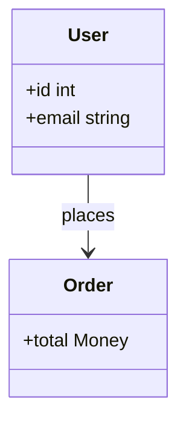
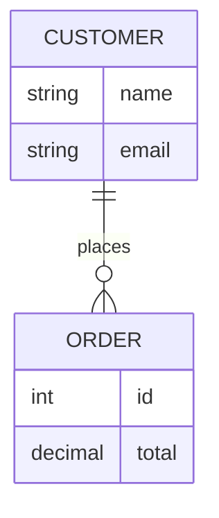

# Atelier Diagram

PHP diagrams that can be built as typed models, parsed from Mermaid, rendered to SVG, and serialized back to canonical Mermaid.

`atelier/diagram` is for applications that need diagram output without a browser, JavaScript runtime, or external CLI. It keeps the pipeline explicit:

```text
PHP builder or Mermaid text -> typed model -> layout scene -> SVG
                                 |
                                 `-> canonical Mermaid markdown
```

<p>
  
  
</p>

> A fuller showcase mosaic can be generated with `composer showcase:page`; commit the curated artifacts under `docs/images/` to grow this strip.

Every type below has a fluent PHP builder and SVG rendering. All types except Venn also have a precise Mermaid-like parser and canonical Mermaid emission.

| Type | Builder | Mermaid in | Mermaid out | SVG |
|------|:-------:|:----------:|:-----------:|:---:|
| State | yes | subset | yes | yes |
| Venn | yes | no | no | yes |
| Git graph | yes | subset | yes | yes |
| Sequence | yes | subset | yes | yes |
| Flowchart | yes | subset | yes | yes |
| Class | yes | subset | yes | yes |
| ER | yes | subset | yes | yes |
| Timeline | yes | subset | yes | yes |
| Journey | yes | subset | yes | yes |
| Mindmap | yes | subset | yes | yes |
| Requirement | yes | subset | yes | yes |
| Kanban | yes | subset | yes | yes |
| Block | yes | subset | yes | yes |
| Architecture | yes | subset | yes | yes |
| C4 | yes | subset | yes | yes |

`Mermaid in` is a subset for every textual type: unsupported syntax throws `ParseException` rather than degrading silently (see [Mermaid support](docs/mermaid.md) for the exact grammar per type). Venn currently has no text grammar in this package.

## Maturity

The core diagram families are **State**, **Git graph**, **Sequence**, **Flowchart**, and **Class**. These are the paths that receive the strictest expectations for parser clarity, round-trip behavior, layout polish, screenshots, and documentation.

The other families, **Venn**, **ER**, **Timeline**, **Journey**, **Mindmap**, **Requirement**, **Kanban**, **Block**, **Architecture**, and **C4**, are supported but earlier. They are useful, tested, and documented, but their layout algorithms and Mermaid subsets are intentionally smaller while the shared layout layer hardens.

## Installation

```bash
composer require atelier/diagram
```

Requires PHP 8.3+. SVG output is produced through `atelier/svg`; layout-heavy diagram engines share spatial primitives from `atelier/layout`.

The package requires `atelier/layout` with a `^1.0@dev` constraint while the sibling package is still developed locally. The workspace keeps a Composer path repository at `../layout`, mapped to version `1.x-dev`, so development can use the sibling checkout without publishing a tag.

## Build A Diagram

```php
use Atelier\Diagram\Diagram;

$order = Diagram::state()
    ->title('Order lifecycle')
    ->initial('Draft')
    ->transition('Draft', 'Review', 'submit')
    ->transition('Review', 'Approved', 'approve')
    ->transition('Review', 'Draft', 'reject')
    ->transition('Approved', 'Shipped', 'ship')
    ->final('Shipped')
    ->build();

Diagram::of($order)->saveSvg('order.svg');
```

Every builder returns an immutable model. Wrap it with `Diagram::of($model)` to render it:

```php
$svg = Diagram::of($order)->toSvg();
$document = Diagram::of($order)->toSvgDocument();
$markdown = Diagram::of($order)->toMarkdown();
$mermaid = Diagram::of($order)->toMermaid();
```

## Parse Mermaid

```php
use Atelier\Diagram\Diagram;

$diagram = Diagram::fromMermaid(<<<'MERMAID'
    sequenceDiagram
        participant User
        participant Api as API
        User->>Api: Checkout
        Api-->>User: Receipt
    MERMAID);

$svg = $diagram->toSvg();
$canonical = $diagram->toMermaid();
```

The Mermaid support is intentionally a precise subset. Unsupported syntax throws `ParseException` with the source line instead of being silently ignored. Everything a parser accepts, the Mermaid emitter can re-emit, so `Mermaid -> model -> canonical Mermaid` is stable for the supported subset.

## Class Diagram Example

```php
$diagram = Diagram::classDiagram()
    ->member('User', '+id int')
    ->member('User', '+email string')
    ->member('Order', '+total Money')
    ->relation('User', 'Order', 'places')
    ->build();

file_put_contents('classes.svg', Diagram::of($diagram)->toSvg());
```

Equivalent Mermaid:



## ER Diagram Example

```php
$diagram = Diagram::er()
    ->attribute('CUSTOMER', 'string', 'name')
    ->attribute('CUSTOMER', 'string', 'email')
    ->attribute('ORDER', 'int', 'id')
    ->attribute('ORDER', 'decimal', 'total')
    ->relationship('CUSTOMER', '||', 'ORDER', 'o{', 'places')
    ->build();

file_put_contents('er.svg', Diagram::of($diagram)->toSvg());
```

Equivalent Mermaid:



## Venn In A Fixed Canvas

```php
$venn = Diagram::venn()
    ->set('Frontend')
    ->set('Backend')
    ->regionLabel('AB', 'Shared capability')
    ->targetSize(200, 400)
    ->paddingPercent(4)
    ->innerPaddingPercent(4)
    ->circleStrokeWidth(10)
    ->build();

$svg = Diagram::of($venn)->toSvg();
```

That path validates the shared layout package: target canvas sizing, percent padding, fixed stroke width, circle safe areas, and multiline text layout are all solved before SVG rendering.

## Design Guarantees

- **Typed models first**: diagram semantics live in model objects, not in SVG strings.
- **Renderer boundary**: layout engines output a renderer-agnostic `Scene`; only `Renderer\Svg` depends on `atelier/svg`.
- **Deterministic output**: layout math and text measurement are stable enough for snapshot tests.
- **Strict parsers**: unsupported Mermaid syntax fails loudly with line numbers.
- **Round trips**: parser and markdown renderer are kept symmetrical for every supported grammar.

## Documentation

- [Getting started](docs/getting-started.md)
- [Mermaid support](docs/mermaid.md)
- [State diagrams](docs/state-diagram.md)
- [Venn diagrams](docs/venn-diagram.md)
- [Git graphs](docs/git-graph.md)
- [Sequence diagrams](docs/sequence-diagram.md)
- [Flowcharts](docs/flowchart.md)
- [Class diagrams](docs/class-diagram.md)
- [ER diagrams](docs/er-diagram.md)
- [Timeline diagrams](docs/timeline-diagram.md)
- [Journey diagrams](docs/journey-diagram.md)
- [Mindmap diagrams](docs/mindmap-diagram.md)
- [Kanban diagrams](docs/kanban-diagram.md)
- [Requirement diagrams](docs/requirement-diagram.md)
- [Block diagrams](docs/block-diagram.md)
- [Architecture diagrams](docs/architecture-diagram.md)
- [C4 diagrams](docs/c4-diagram.md)
- [Showcase](docs/showcase.md)
- [Package maturity](docs/maturity.md)
- [Theming](docs/theming.md)
- [Renderers](docs/renderers.md)
- [Internal architecture](docs/architecture.md)

## Examples

Generate the local demo index:

```bash
php examples/demo.php
```

The demo writes `examples/output/index.html`. It runs the gallery, showcase, label-polish, and effects generators, then creates one browser entry point for the generated pages.

Generate all gallery artifacts:

```bash
php examples/gallery.php
```

The generated files land in `examples/output/`: SVG examples, canonical Mermaid markdown, and a renderer smoke scene.

Generate the full-viewport HTML showcase deck:

```bash
composer showcase:page
```

The deck is written to `examples/output/showcase/index.html`. It contains full-screen sections for the main Mermaid-like diagram types, each with an SVG demo, supported-options notes, canonical Mermaid source, and a PHP builder sample.

Generate the label-polish audit:

```bash
php examples/label-polish.php
```

The audit is written to `examples/output/label-polish/`. It creates an index and one page per diagram family, with short and long labels covering routes, legends, node text, grouped labels, and values.

## Development

```bash
composer parser
composer qa
composer benchmark:parser
php examples/demo.php
composer label-polish
composer showcase:page
composer validate --strict
php examples/gallery.php
```

`composer qa` runs coding style checks, PHPStan, and PHPUnit. Tests include parser errors, model validation, Mermaid round trips, layout snapshots, and SVG renderer coverage.
`composer parser` runs the Mermaid corpus verifier, parser rule verifier, and parser PHPUnit suite.
`composer benchmark:parser` profiles three parser paths on representative samples: public parse, already-dispatched parse, and detect-only header lookup.
Run QA with PHP 8.3 when checking release compatibility; newer PHP runtimes can make PHP CS Fixer suggest syntax that the package promise does not allow.

The benchmark output labels each sample with its mode:

```text
- state (public): ...
- state-dispatched (dispatch): ...
- state-detect-heavy (detect): ...
- Mode summary
- public: ...
- dispatch: ...
- detect: ...
```

## License

MIT.
