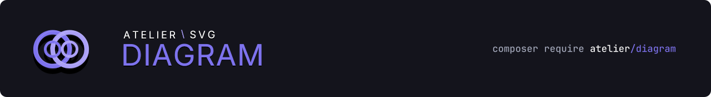
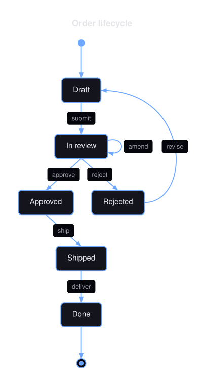
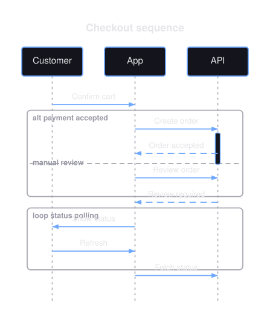

<h1 align="center">
  
</h1>

<p align="center">Fifteen diagram families, from PHP or from Mermaid, rendered to SVG without a browser.</p>

<p align="center">
  
  
  
  
  
  
</p>

Build a typed model with a fluent builder, or parse a documented Mermaid subset, then render
deterministic SVG. No headless browser, no JavaScript runtime, no external binary.

```php
echo Diagram::fromMermaid($source)->toSvg();
```

<p align="center">
  
  &nbsp;
  
</p>

The same model renders back to canonical Mermaid, and round-trip tests hold both directions to
it. Backed by an extensive test suite and PHPStan at its highest level.

**[Diagram types](#fifteen-diagram-types) · [Build from PHP](#build-from-php) ·
[Parse Mermaid](#parse-mermaid) · [Render](#render) · [Theming](#theming) ·
[Documentation](#documentation)**

## Installation

```bash
composer require atelier/diagram
```

Requires PHP 8.3 or later. Depends on `atelier/svg` for output and `atelier/layout` for
spatial maths, both pure PHP.

## Quick start

```php
use Atelier\Diagram\Diagram;

$source = <<<'MERMAID'
stateDiagram-v2
    [*] --> Draft
    Draft --> Review: submit
    Review --> [*]: approve
MERMAID;

file_put_contents('order.svg', Diagram::fromMermaid($source)->toSvg());
```

The grammar is detected from the first significant line. See
[Getting started](docs/getting-started.md).

## Fifteen diagram types

| Type | Mermaid header | Type | Mermaid header |
|---|---|---|---|
| [Flowchart](docs/diagrams/flowchart.md) | `flowchart` | [Mindmap](docs/diagrams/mindmap-diagram.md) | `mindmap` |
| [State](docs/diagrams/state-diagram.md) | `stateDiagram-v2` | [Requirement](docs/diagrams/requirement-diagram.md) | `requirementDiagram` |
| [Sequence](docs/diagrams/sequence-diagram.md) | `sequenceDiagram` | [Kanban](docs/diagrams/kanban-diagram.md) | `kanban` |
| [Class](docs/diagrams/class-diagram.md) | `classDiagram` | [Block](docs/diagrams/block-diagram.md) | `block` |
| [ER](docs/diagrams/er-diagram.md) | `erDiagram` | [Architecture](docs/diagrams/architecture-diagram.md) | `architecture` |
| [Git graph](docs/diagrams/git-graph.md) | `gitGraph` | [C4](docs/diagrams/c4-diagram.md) | `C4Context` |
| [Timeline](docs/diagrams/timeline-diagram.md) | `timeline` | [Venn](docs/diagrams/venn-diagram.md) | builder only |
| [Journey](docs/diagrams/journey-diagram.md) | `journey` | | |

Each page shows the same diagram three ways: its Mermaid source, the equivalent PHP, and the
rendered result. Venn diagrams have no text form in this package.

## Build from PHP

Every type has a fluent builder reached from the facade, and each one speaks its own domain:
states and transitions, participants and messages, commits and branches.

```php
use Atelier\Diagram\Diagram;

$order = Diagram::state()
    ->title('Order lifecycle')
    ->initial('Draft')
    ->transition('Draft', 'Review', 'submit')
    ->transition('Review', 'Approved', 'approve')
    ->transition('Review', 'Draft', 'reject')
    ->final('Approved')
    ->build();

Diagram::of($order)->saveSvg('order.svg');
```

The builder returns a typed model, not markup, so it can be inspected, tested, and rendered more
than once.

## Parse Mermaid

Fourteen of the fifteen families parse a deliberately small, exactly specified Mermaid subset.
Anything outside it throws a `ParseException` carrying the offending line number, rather than
silently rendering something else.

```php
$diagram = Diagram::fromMermaid($source);   // throws on anything unsupported
$maybe   = Diagram::tryFromMermaid($source); // null instead of an exception
```

What the parser accepts, the Markdown renderer emits, and round-trip tests hold both sides to
it. See [Mermaid support](docs/mermaid.md).

## Render

```php
$diagram = Diagram::fromMermaid($source);

$diagram->toSvg();        // a string of SVG markup
$diagram->saveSvg($path); // the same, written to a file
$diagram->toMermaid();    // canonical Mermaid, back from the model
$diagram->toMarkdown();   // a fenced Mermaid block, for a README
```

`toSvgDocument()` hands back an `atelier/svg` document when the diagram has to compose into a
larger drawing. See [Renderers](docs/renderers.md).

## Theming

Five presets, and every colour, font and spacing value is a field you can override.

```php
use Atelier\Diagram\Theme\Theme;

$diagram->toSvg(Theme::dark());
```

`default`, `dark`, `blueprint`, `mono`, and `neutral`. See [Theming](docs/theming.md).

## Documentation

- [Getting started](docs/getting-started.md): install, first diagram, first render.
- [Every diagram type](docs/diagrams/overview.md): compare the fifteen and pick one.
- [Theming](docs/theming.md): presets, and the fields each one sets.
- [Renderers](docs/renderers.md): SVG, Markdown, and canonical Mermaid.
- [Mermaid support](docs/mermaid.md): the accepted subset, grammar by grammar.

The full documentation is published at [ateliersvg.com/diagram](https://ateliersvg.com/diagram/).

## Contributing

Contributions are welcome. Visit the [project on GitHub](https://github.com/ateliersvg/diagram)
to [report a bug](https://github.com/ateliersvg/diagram/issues/new),
[suggest a feature](https://github.com/ateliersvg/diagram/issues/new), or
[open a pull request](https://github.com/ateliersvg/diagram/pulls).

Before submitting code, run:

```bash
composer qa   # PHP-CS-Fixer, PHPStan at level max, and PHPUnit
```

Changes to public behaviour need a test and a documentation update.

## Support

Bug reports, security disclosures, and contribution guidelines are collected at
[ateliersvg.com/support](https://ateliersvg.com/support/).

Sharing the package or [starring it on GitHub](https://github.com/ateliersvg/diagram) helps more
than you would think.

## License

Atelier Diagram is released under the [MIT License](LICENSE).
