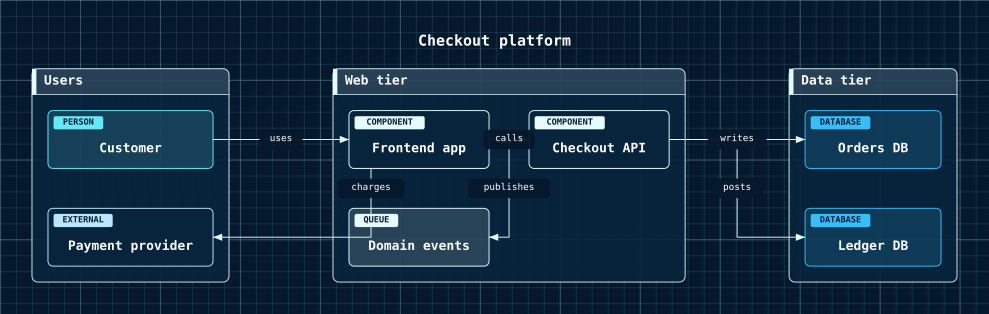

# Architecture Diagrams

An architecture diagram is a set of typed nodes, optional groups that zone them, and directed relationships between nodes.


- [Overview](#overview)
- [Format](#format)
- [Builder API](#builder-api)
- [Options](#options)
- [Themes](#themes)
- [Parse](#parse)
- [Debug](#debug)

## Overview

The model lives in `Atelier\Diagram\Architecture\`: `ArchitectureDiagram`, `ArchitectureGroup` (`id`, `label`), `ArchitectureNode` (`id`, `kind`, `label`, optional `groupId`), `ArchitectureNodeKind` (an enum), and `ArchitectureRelationship` (`from`, `to`, optional `label`). All model classes are immutable.

Reach for it to sketch software structure: system overviews, service boundaries, data tiers, and integration maps. Each node carries a kind badge (`COMPONENT`, `DATABASE`, `QUEUE`, and so on) and groups read as zones. It is a small generic grammar. For formal C4 notation, use [C4 diagrams](c4-diagram.md) instead.

## Format


Node ids match `[A-Za-z_][A-Za-z0-9_]*`. Node kinds are `person`, `system`, `container`, `component`, `database`, `queue`, and `external`. A `group` opens a lane; nodes declared after it belong to it until the next `group`. There is no `end` statement and no indentation-derived nesting; indentation is cosmetic. Full grammar: [Mermaid support](../mermaid.md#architecture-subset).

## Builder API

`ArchitectureDiagramBuilder` (or `Diagram::architecture()`, which returns it) is the one way to build the model:

```php
use Atelier\Diagram\Diagram;

$diagram = Diagram::architecture()
    ->title('Checkout platform')
    ->group('Web', 'Web tier')
    ->component('App', 'Frontend app', 'Web')
    ->component('Api', 'Checkout API', 'Web')
    ->group('Data', 'Data tier')
    ->database('Orders', 'Orders DB', 'Data')
    ->relationship('App', 'Api', 'calls')
    ->relationship('Api', 'Orders', 'writes')
    ->build();

Diagram::of($diagram)->saveSvg('architecture.svg');
```

- `title($text)` - sets a title. Non-empty; optional.
- `group($id, $label)` - declares a group lane. The id must be a supported identifier; the label defaults to the id. Duplicate ids throw.
- `person($id, $label, $groupId)` / `system(...)` / `container(...)` / `component(...)` / `database(...)` / `queue(...)` / `external(...)` - declare a node of that kind. The label defaults to the id; `groupId` must reference a declared group. Duplicate node ids throw.
- `node($kind, $id, $label, $groupId)` - the generic form; `$kind` is a token string or an `ArchitectureNodeKind`. The typed methods above delegate to it.
- `relationship($from, $to, $label)` - adds a directed relationship. Both endpoints must be declared nodes; the label is optional.
- `build()` - assembles the model in declaration order. The builder validates eagerly (unknown group, unknown relationship endpoint, duplicate id, bad identifier all throw `InvalidArgumentException` at call time).

## Options

| Setting | Default | Effect |
|---|---|---|
| `title(string)` | none | heading above the diagram |
| `group(...)` | none | cluster box laid out left-to-right; ungrouped nodes place outside lanes |

- **Node kinds**: each kind sets the badge text and its fill/stroke colors (see Themes).
- **Determinism**: layout is source-order based and deterministic; the same model always yields the same SVG.

`Layout\Architecture\ArchitectureLayoutEngine` arranges groups as cluster boxes with a header rail, places nodes inside them in a grid by declaration order, and routes relationships between node boxes with `atelier/layout`'s orthogonal router, drawing explicit arrowheads. Relationship labels sit over a halo through the shared route-label helper.

## Themes

Node colors are keyed by kind. `component` uses `nodeFillColor` / `nodeStrokeColor`; `external` uses a muted stroke (`mutedTextColor`); `person`, `system`, `container`, `database`, and `queue` each take a distinct entry from `accentColors` (cycled by index) for their stroke, kind badge, and a translucent fill wash of the same hue, so a palette with several colors keeps kinds visually separated. Badge text uses `backgroundColor` so it stays readable on any accent. Group headers, node strokes, and relationship arrows use `nodeStrokeColor`; labels use `textColor`.

All presets apply (`Theme::default()`, `dark()`, `blueprint()`, `mono()`, `neutral()`), and a `Scene\BackgroundPattern` (as in `blueprint()`) sits behind the diagram. See [Theming](../theming.md).



`Theme::blueprint()` on the same services. Group boundaries and node shapes are model concerns; only the palette moved.

## Parse

Header keyword: `architecture`.

```php
$diagram = Diagram::fromMermaid($source);        // throws ParseException
$result  = Diagram::tryFromMermaid($source);      // non-throwing ParseResult
```

`toMermaid()` / `toMarkdown()` serialize a built model back to the canonical form. Full grammar and round-trip rules: [Mermaid support](../mermaid.md#architecture-subset).

## Debug

On a rejected source, inspect `ParseResult::getDiagnostic()` (a `ParserDiagnostic` with a message, a stable `code`, and a source span) or catch `ParseException` (`getLineNumber()`, `getSourceLine()`). Render a code frame with `ParserDiagnosticFormatter`:

```php
$result = Diagram::tryFromMermaid($source);
if ($result->isFailure()) {
    echo \Atelier\Diagram\Parser\Support\ParserDiagnosticFormatter::format($result->getDiagnostic());
}
```

See [parser diagnostics](../mermaid.md#debugging).
