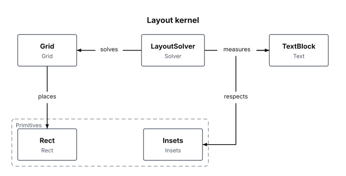

# Block Diagrams

A block diagram is a set of rectangular blocks, optional one-level groups that frame related blocks, and directed connectors between them.

<figure class="diagram-intro">

<figcaption>Grouped blocks connected by directed relationships.</figcaption>
</figure>

- [Overview](#overview)
- [Format](#format)
- [Builder API](#builder-api)
- [Options](#options)
- [Themes](#themes)
- [Parse](#parse)
- [Debug](#debug)

## Overview

The model lives in `Atelier\Diagram\Block\`: `BlockDiagram`, `BlockNode` (`id`, `label` defaulting to the id, optional `groupId`), `BlockGroup` (`id`, `label`, member node ids), and `BlockRelationship` (`from`, `to`, optional label). All model classes are immutable.

Reach for it for generic composition sketches: architecture notes, package maps, or layout-kernel diagrams where plain blocks, clusters, and directed connectors are enough. It is not a graph solver: blocks are placed on a deterministic grid in source order, groups expand into visual clusters, and relationships are routed orthogonally. Use a [flowchart](flowchart.md) when you need process steps and decisions, or an [architecture diagram](architecture-diagram.md) for typed service topology.

## Format

Block diagrams round-trip through a `block` subset:

```mermaid
block
    title Layout kernel
    block Solver [LayoutSolver]
    block Grid [Grid]
    block Text [TextBlock]
    group Primitives [Primitives]
        block Rect [Rect]
        block Insets [Insets]
    end
    Solver -> Grid
    Solver -> Text : measures
```

Ids match `[A-Za-z_][A-Za-z0-9_]*`. Labels are plain bracket text. Groups are one level only: nested groups are rejected, never skipped. Relationship endpoints are auto-declared when no `block` line exists. Full grammar: [Mermaid support](../mermaid.md#block-diagram-subset).

## Builder API

`BlockDiagramBuilder` (or `Diagram::block()`, which returns it) is the one way to build the model:

```php
use Atelier\Diagram\Diagram;

$diagram = Diagram::block()
    ->title('Layout kernel')
    ->block('Solver', 'LayoutSolver')           // id + display label
    ->block('Grid', 'Grid')
    ->block('Text', 'TextBlock')
    ->beginGroup('Primitives', 'Primitives')    // open a one-level group
        ->block('Rect', 'Rect')
        ->block('Insets', 'Insets')
    ->endGroup()
    ->relationship('Solver', 'Grid')            // directed connector
    ->relationship('Solver', 'Text', 'measures')
    ->build();

Diagram::of($diagram)->saveSvg('layout-kernel.svg');
```

`title()`
: Sets a title. It is dropped during serialization because the Mermaid grammar has no place for it.

  | Argument | Type | Description |
  |---|---|---|
  | `$text` | `string` | Non-empty title. |

`block()`
: Declares a block. Blocks declared between `beginGroup()` and `endGroup()` join that group.

  | Argument | Type | Description |
  |---|---|---|
  | `$id` | `string` | Unique block identifier. |
  | `$label` | `?string` | Display label; defaults to `$id`. |

`beginGroup()`
: Opens a one-level group. Nested groups and duplicate ids throw.

  | Argument | Type | Description |
  |---|---|---|
  | `$id` | `string` | Unique group identifier. |
  | `$label` | `?string` | Display label; defaults to `$id`. |

`endGroup()`
: Closes the current group. Throws if none is open.

`relationship()`
: Adds a directed connector and auto-declares unknown endpoints with their id as label.

  | Argument | Type | Description |
  |---|---|---|
  | `$from` | `string` | Source block identifier. |
  | `$to` | `string` | Target block identifier. |
  | `$label` | `?string` | Optional connector label. |

`build()`
: Assembles the immutable `BlockDiagram`. An open group, an empty diagram, or a group without members throws.

## Options

| Setting | Default | Effect |
|---|---|---|
| `title(string)` | none | heading above the grid; it reserves vertical space |
| `beginGroup()` / `endGroup()` | none | dashed cluster frame around contiguous members |

- **Determinism**: layout is source-order based and deterministic; the same model always yields the same SVG.

`Layout\Block\BlockLayoutEngine` sizes each block to its measured label and id, lays blocks out on a grid of up to three columns in source order, derives group frames from the bounding box of their members, then routes relationships between block rectangles with `atelier/layout` orthogonal routing. Blocks render as rounded rectangles with the label in bold over the id; group frames are dashed and light; relationship labels sit over a background halo and are placed to avoid overlapping blocks and group labels.

## Themes

Block diagrams use `nodeFillColor` for block boxes, `mutedTextColor` for block and group borders and the id text, `nodeStrokeColor` for connectors and arrowheads, and `textColor` for labels.

All presets apply (`Theme::default()`, `dark()`, `blueprint()`, `mono()`, `neutral()`). See [Theming](../theming.md).



`Theme::mono()` on the same blocks. Groups are drawn as outlines, which is why they read without a fill colour.

## Parse

Header keyword: `block`.

```php
$diagram = Diagram::fromMermaid($source);        // throws ParseException
$result  = Diagram::tryFromMermaid($source);      // non-throwing ParseResult
```

`toMermaid()` / `toMarkdown()` serialize a built model back; titles are dropped because the grammar has no place for them, and labels containing `]` or line breaks are rejected. Full grammar and round-trip rules: [Mermaid support](../mermaid.md#block-diagram-subset).

## Debug

On a rejected source, inspect `ParseResult::getDiagnostic()` (a `ParserDiagnostic` with a message, a stable `code`, and a source span) or catch `ParseException` (`getLineNumber()`, `getSourceLine()`). Render a code frame with `ParserDiagnosticFormatter`:

```php
$result = Diagram::tryFromMermaid($source);
if ($result->isFailure()) {
    echo \Atelier\Diagram\Parser\Support\ParserDiagnosticFormatter::format($result->getDiagnostic());
}
```

See [parser diagnostics](../mermaid.md#debugging).
