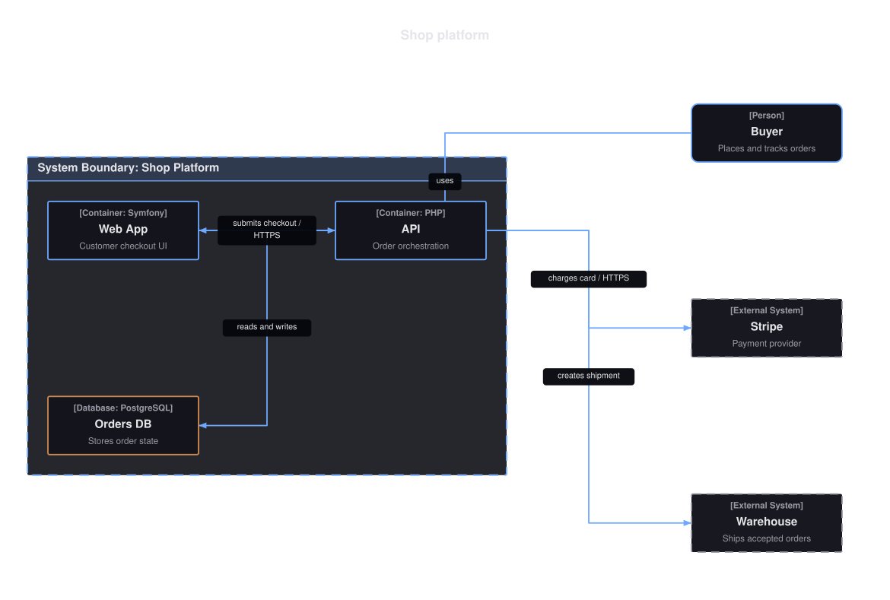
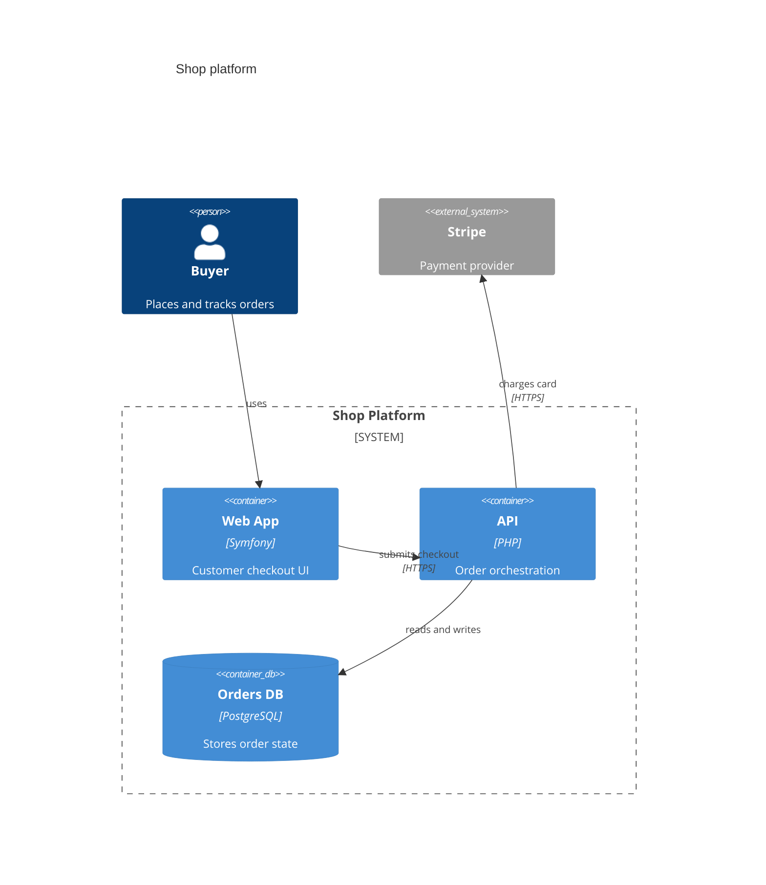
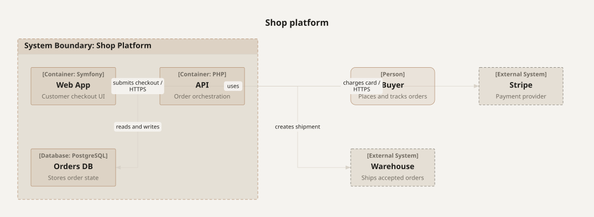

# C4 Diagrams

A C4 diagram models software architecture as people, systems, containers, and components, grouped into boundaries and joined by directed relationships.



- [Overview](#overview)
- [Format](#format)
- [Builder API](#builder-api)
- [Options](#options)
- [Themes](#themes)
- [Parse](#parse)
- [Debug](#debug)

## Overview

The model lives in `Atelier\Diagram\C4\`: `C4Diagram`, `C4Element` (`id`, `kind`, `label`, optional `technology` and `description`, optional `boundaryId`), `C4Boundary` (`id`, `label`), and `C4Relationship` (`from`, `to`, `label`, optional `technology`). Element kinds are the `C4ElementKind` enum (person, system, container, component, each with an external variant, plus container and component databases); the view level is the `C4View` enum (`Context`, `Container`, `Component`). All model classes are immutable.

Reach for it to document a system in the C4 style: who uses it, which systems it talks to, and how it decomposes into containers and components. This is a documentation-oriented subset, not full Mermaid C4 parity: one-level boundaries, relationship and technology labels, strict parsing, deterministic SVG. Nested boundaries, deployment nodes, dynamic views, sprites, tags, and styling macros are rejected, not skipped.

## Format

C4 diagrams round-trip through a Mermaid C4 subset. The header is one of `C4Context`, `C4Container`, or `C4Component`:



Ids match `[A-Za-z_][A-Za-z0-9_]*`. Full grammar: [Mermaid support](../mermaid.md#c4-subset).

## Builder API

`C4DiagramBuilder` (or `Diagram::c4()`, which returns it) is the one way to build the model:

```php
use Atelier\Diagram\Diagram;

$diagram = Diagram::c4()
    ->containerView()
    ->title('Shop platform')
    ->person('buyer', 'Buyer', 'Places and tracks orders')
    ->externalSystem('stripe', 'Stripe', 'Payment provider')
    ->boundary('shop', 'Shop Platform')
        ->container('web', 'Web App', 'Symfony', 'Customer checkout UI')
        ->container('api', 'API', 'PHP', 'Order orchestration')
        ->database('db', 'Orders DB', 'PostgreSQL', 'Stores order state')
    ->endBoundary()
    ->relationship('buyer', 'web', 'uses')
    ->relationship('web', 'api', 'submits checkout', 'HTTPS')
    ->relationship('api', 'db', 'reads and writes')
    ->relationship('api', 'stripe', 'charges card', 'HTTPS')
    ->build();

Diagram::of($diagram)->saveSvg('out.svg');
```

- `contextView()` / `containerView()` / `componentView()` - set the view level (`C4Context` / `C4Container` / `C4Component`). `view(C4View)` is the underlying setter; the default is context.
- `title($text)` - sets a title (dropped on serialization; the grammar has no place for it).
- `boundary($id, $label)` - opens a one-level boundary. Elements declared after it land inside until `endBoundary()`. Duplicate boundary ids throw.
- `endBoundary()` - closes the current boundary. Throws if none is open.
- `person($id, $label, $description, $boundaryId)` / `externalPerson(...)` - declare a person (`Person` / `Person_Ext`).
- `system(...)` / `externalSystem(...)` - declare a software system (`System` / `System_Ext`).
- `container($id, $label, $technology, $description, $boundaryId)` / `externalContainer(...)` / `database(...)` - declare a container, external container, or container database (`Container` / `Container_Ext` / `ContainerDb`).
- `component(...)` / `externalComponent(...)` / `componentDatabase(...)` - declare a component, external component, or component database (`Component` / `Component_Ext` / `ComponentDb`).
- `element(C4ElementKind, $id, $label, $technology, $description, $boundaryId)` - the generic form the typed helpers call. Duplicate element ids and unknown `boundaryId` throw.
- `relationship($from, $to, $label, $technology)` - adds a directed relationship. Both endpoints must already be declared, or it throws.
- `build()` - assembles the immutable `C4Diagram` in declaration order.

## Options

| Setting | Default | Effect |
|---|---|---|
| `view(C4View)` | `C4View::Context` | abstraction level and Mermaid header |
| `contextView()` / `containerView()` / `componentView()` | `contextView()` | shorthand for the three levels |
| `title(string)` | none | heading above the view |
| `boundary()` / `endBoundary()` | none | groups elements into one dashed cluster; no nesting |

- **Text lanes**: relationship label width widens the route lanes so labeled edges do not overlap boxes.
- **Determinism**: layout is source-order based; the same model always yields the same SVG.

`Layout\C4\C4LayoutEngine` places elements on a deterministic grid in declaration order, draws boundaries as dashed cluster boxes with a header band, folds technology into a bracketed stereotype line (for example `[Container: Symfony]`), keeps the description as secondary text inside the box, and routes relationships as orthogonal arrows with label backgrounds via the shared route-label helper.

## Themes

C4 diagrams draw their notation colors from `accentColors`: people, internal systems, containers, and components stroke and wash with the first accent, databases with the fourth (cycled on shorter palettes), and external elements use `nodeFillColor` with a muted dashed outline. Fills are translucent washes of the accent, so they adapt to light and dark canvases.

From the theme the layout also reads `fontFamily`, `fontSize`, `textColor`, and `mutedTextColor` for labels and stereotypes, `nodeFillColor` for boundary panels, `nodeStrokeColor` and `strokeWidth` for separators and relationship arrows, `spacingUnit` for spacing, and `backgroundColor` for the canvas. Every preset restyles the full drawing, including element fills. See [Theming](../theming.md).



`Theme::neutral()` on the same view. C4 leans on shape and boundary rather than hue, so it survives the quietest preset.

## Parse

Header keyword: `C4Context` (also `C4Container` and `C4Component`).

```php
$diagram = Diagram::fromMermaid($source);        // throws ParseException
$result  = Diagram::tryFromMermaid($source);      // non-throwing ParseResult
```

The parser accepts quoted labels, descriptions, and technology fields, and does not preserve original formatting; `toMermaid()` emits canonical macro calls. Full grammar and round-trip rules: [Mermaid support](../mermaid.md#c4-subset).

## Debug

On a rejected source, inspect `ParseResult::getDiagnostic()` (a `ParserDiagnostic` with a message, a stable `code`, and a source span) or catch `ParseException` (`getLineNumber()`, `getSourceLine()`). Render a code frame with `ParserDiagnosticFormatter`:

```php
$result = Diagram::tryFromMermaid($source);
if ($result->isFailure()) {
    echo \Atelier\Diagram\Parser\Support\ParserDiagnosticFormatter::format($result->getDiagnostic());
}
```

See [parser diagnostics](../mermaid.md#debugging).
