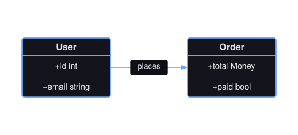
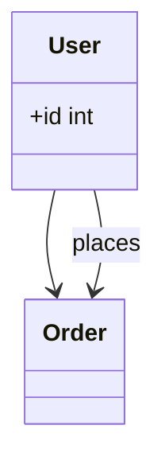
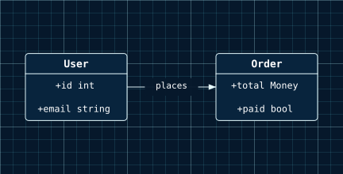

# Class Diagrams

A class diagram is a set of named class boxes, each holding member rows, plus the directed relations between them.

<figure class="diagram-intro">

<figcaption>Classes, their members, and the relations between them.</figcaption>
</figure>

- [Overview](#overview)
- [Format](#format)
- [Builder API](#builder-api)
- [Options](#options)
- [Themes](#themes)
- [Parse](#parse)
- [Debug](#debug)

## Overview

The model lives in `Atelier\Diagram\ClassDiagram\`: `ClassDiagram` (the class boxes and relations), `ClassBox` (`id` plus its member rows), `ClassMember` (a single `text` row), and `ClassRelation` (`from`, `to`, optional label). All model classes are immutable.

Reach for it to show the shape of a type model: the classes in a domain, the fields and operations on each, and how they reference one another. Use an [ER diagram](er-diagram.md) instead when you are modeling database entities and their keyed relationships rather than code-level types.

## Format

Class diagrams round-trip through a `classDiagram` subset:



Class ids match `[A-Za-z_][A-Za-z0-9_]*`. Classes referenced by members or relations are auto-declared in first-use order. Inheritance arrows, class blocks, annotations, namespaces, generics, structured method parsing, and styling are rejected, never skipped. Full grammar: [Mermaid support](../mermaid.md#class-diagram-subset).

## Builder API

`ClassDiagramBuilder` (or `Diagram::classDiagram()`, which returns it) is the one way to build the model:

```php
use Atelier\Diagram\Diagram;

$diagram = Diagram::classDiagram()
    ->class('User')                             // declare a class
    ->member('User', '+id int')                 // add a member row
    ->member('User', '+email string')
    ->member('Order', '+total Money')           // auto-declares Order
    ->relation('User', 'Order', 'places')       // labeled directed relation
    ->build();

Diagram::of($diagram)->saveSvg('classes.svg');
```

`class()`
: Declares a class. Repeating an id is a no-op; an empty id throws.

  | Argument | Type | Description |
  |---|---|---|
  | `$id` | `string` | Class identifier. |

`member()`
: Appends a member row and auto-declares the class if unseen. Declaration order is the layout tie-breaker.

  | Argument | Type | Description |
  |---|---|---|
  | `$classId` | `string` | Owning class identifier. |
  | `$text` | `string` | Member row text. |

`relation()`
: Adds a directed relation and auto-declares unknown endpoints.

  | Argument | Type | Description |
  |---|---|---|
  | `$from` | `string` | Source class identifier. |
  | `$to` | `string` | Target class identifier. |
  | `$label` | `?string` | Optional relation label. |

`build()`
: Assembles the immutable `ClassDiagram` in declaration order.

## Options

| Setting | Default | Effect |
|---|---|---|
| `member(...)` | none | one row under the class name; a class with none renders as a bare titled box |
| `Theme::minNodeWidth` / `minNodeHeight` | `null` | floor for boxes, which otherwise fit their widest row |

- **Determinism**: layout is source-order based and deterministic; the same model always yields the same SVG.

`Layout\ClassDiagram\ClassDiagramLayoutEngine` places class boxes in a source-order grid and routes relations with `atelier/layout` orthogonal ports. Class names and member rows are bounded and wrapped, so long labels do not force unusable boxes. Relation labels are centered on the route, wrapped when needed, and drawn over a background halo so the edge stays readable.

## Themes

Class diagrams use `nodeFillColor` and `nodeStrokeColor` for the boxes and their row separators, `nodeStrokeColor` for relation edges and arrowheads, and `textColor` for class names and member rows.

All presets apply (`Theme::default()`, `dark()`, `blueprint()`, `mono()`, `neutral()`), and a `Scene\BackgroundPattern` (as in `blueprint()`) sits behind the boxes. See [Theming](../theming.md).



Pass `Theme::blueprint()` to `toSvg()` for a deep navy canvas with thin cyan strokes.

## Parse

Header keyword: `classDiagram`.

```php
$diagram = Diagram::fromMermaid($source);        // throws ParseException
$result  = Diagram::tryFromMermaid($source);      // non-throwing ParseResult
```

`toMermaid()` / `toMarkdown()` serialize a built model back. Full grammar and round-trip rules: [Mermaid support](../mermaid.md#class-diagram-subset).

## Debug

On a rejected source, inspect `ParseResult::getDiagnostic()` (a `ParserDiagnostic` with a message, a stable `code`, and a source span) or catch `ParseException` (`getLineNumber()`, `getSourceLine()`). Render a code frame with `ParserDiagnosticFormatter`:

```php
$result = Diagram::tryFromMermaid($source);
if ($result->isFailure()) {
    echo \Atelier\Diagram\Parser\Support\ParserDiagnosticFormatter::format($result->getDiagnostic());
}
```

See [parser diagnostics](../mermaid.md#debugging).
