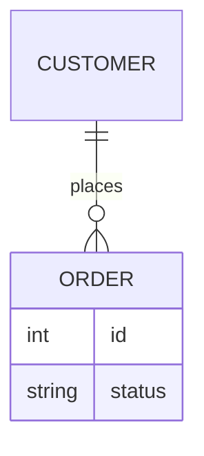
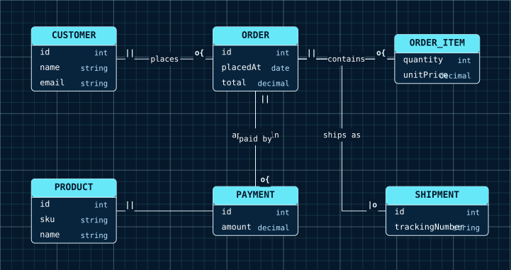

# ER Diagrams

An entity-relationship diagram is a set of entities with typed attribute rows and the labeled relationships between them, each end carrying a cardinality.

<figure class="diagram-intro">

<figcaption>Entities, typed attributes, relationships, and cardinalities.</figcaption>
</figure>

- [Overview](#overview)
- [Format](#format)
- [Builder API](#builder-api)
- [Options](#options)
- [Themes](#themes)
- [Parse](#parse)
- [Debug](#debug)

## Overview

The model lives in `Atelier\Diagram\Er\`: `ErDiagram`, `ErEntity` (`id`, list of attributes), `ErAttribute` (`type`, `name`), `ErRelationship` (`from`, `fromCardinality`, `to`, `toCardinality`, optional label), and the `ErCardinality` enum. All model classes are immutable.

Reach for it to model a data schema: tables and their columns, and how records relate (one customer places many orders). Use a [class diagram](class-diagram.md) instead when you are modeling object types with methods and inheritance rather than data entities and their cardinalities.

## Format



Entity and attribute names match `[A-Za-z_][A-Za-z0-9_]*`; attribute types are single non-space tokens. Cardinality tokens are `|o` (zero or one), `||` (exactly one), `o{` (zero or more), and `|{` (one or more). Entities referenced by a relationship are auto-declared in first-use order. Full grammar: [Mermaid support](../mermaid.md#er-diagram-subset).

## Builder API

`ErDiagramBuilder` (or `Diagram::er()`, which returns it) is the one way to build the model:

```php
use Atelier\Diagram\Diagram;

$diagram = Diagram::er()
    ->attribute('CUSTOMER', 'string', 'name')
    ->attribute('CUSTOMER', 'string', 'email')
    ->attribute('ORDER', 'int', 'id')
    ->attribute('ORDER', 'string', 'status')
    ->relationship('CUSTOMER', '||', 'ORDER', 'o{', 'places')
    ->build();

Diagram::of($diagram)->saveSvg('schema.svg');
```

`entity()`
: Declares an entity without attributes. Repeating an id is a no-op; an empty id throws.

  | Argument | Type | Description |
  |---|---|---|
  | `$id` | `string` | Entity identifier. |

`attribute()`
: Appends a `type name` row, auto-declaring the entity on first use. Rows keep insertion order.

  | Argument | Type | Description |
  |---|---|---|
  | `$entityId` | `string` | Owning entity identifier. |
  | `$type` | `string` | Attribute type. |
  | `$name` | `string` | Attribute name. |

`relationship()`
: Adds a relationship and auto-declares both endpoints. Unknown cardinality tokens throw.

  | Argument | Type | Description |
  |---|---|---|
  | `$from` | `string` | Source entity identifier. |
  | `$fromCardinality` | `string\|ErCardinality` | Source cardinality token or enum case. |
  | `$to` | `string` | Target entity identifier. |
  | `$toCardinality` | `string\|ErCardinality` | Target cardinality token or enum case. |
  | `$label` | `?string` | Optional relationship label. |

`build()`
: Assembles the immutable `ErDiagram` in entity declaration order.

## Options

| Setting | Default | Effect |
|---|---|---|
| `attribute(...)` | none | a name column and a type column inside the entity box |
| `Theme::spacingUnit` | per preset | entity width floor of `15 * spacingUnit`, padding, and gaps |

- **Relationship labels**: a label widens the routing corridor so the text over its background halo does not collide with the connectors.
- **Determinism**: layout is source-order based and deterministic; the same model always yields the same SVG.

`Layout\Er\ErLayoutEngine` places entity boxes in a compact grid, then routes relationships through `atelier/layout` orthogonal routing. Cardinality tokens render as short bold text near each endpoint over a light background rather than crow-foot glyphs.

## Themes

ER diagrams use `nodeFillColor` and `nodeStrokeColor` for entity boxes and connectors, `textColor` for attribute names, and `mutedTextColor` for attribute types. Entity headers use `accentColors[0]` with white title text.

All presets apply (`Theme::default()`, `dark()`, `blueprint()`, `mono()`, `neutral()`), and a `Scene\BackgroundPattern` (as in `blueprint()`) sits behind the entities. See [Theming](../theming.md).



`Theme::blueprint()` on the same entities. Presets are passed at render time, so one model can serve print, screen, and slide decks.

## Parse

Header keyword: `erDiagram`.

```php
$diagram = Diagram::fromMermaid($source);        // throws ParseException
$result  = Diagram::tryFromMermaid($source);      // non-throwing ParseResult
```

Canonical output writes explicit entity blocks even for auto-declared entities. Identifying-relation variants beyond `--`, quoted attribute names, keys, comments, composite attributes, aliases, and styling are rejected, never skipped. Full grammar and round-trip rules: [Mermaid support](../mermaid.md#er-diagram-subset).

## Debug

On a rejected source, inspect `ParseResult::getDiagnostic()` (a `ParserDiagnostic` with a message, a stable `code`, and a source span) or catch `ParseException` (`getLineNumber()`, `getSourceLine()`). Render a code frame with `ParserDiagnosticFormatter`:

```php
$result = Diagram::tryFromMermaid($source);
if ($result->isFailure()) {
    echo \Atelier\Diagram\Parser\Support\ParserDiagnosticFormatter::format($result->getDiagnostic());
}
```

See [parser diagnostics](../mermaid.md#debugging).
