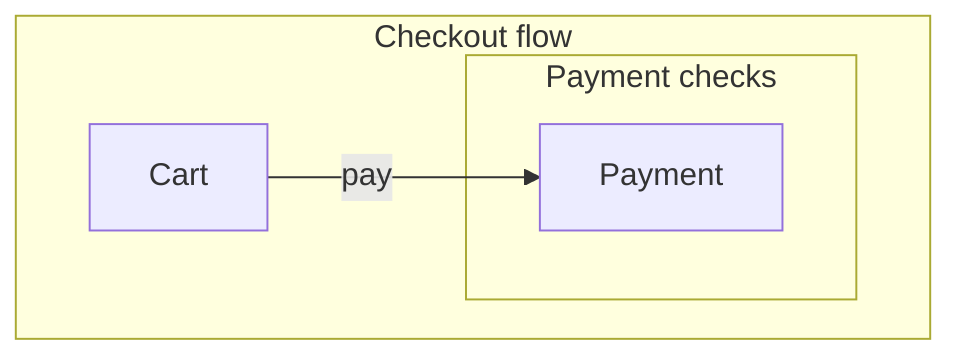
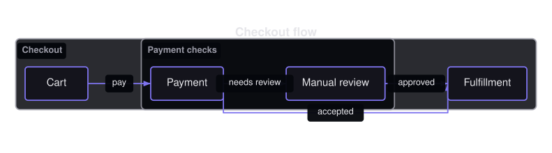

# Flowchart Diagrams

A flowchart is a set of rectangular nodes connected by directed, optionally labeled edges, with optional subgraph clusters grouping related nodes.


- [Overview](#overview)
- [Format](#format)
- [Builder API](#builder-api)
- [Options](#options)
- [Themes](#themes)
- [Parse](#parse)
- [Debug](#debug)

## Overview

The model lives in `Atelier\Diagram\Flow\`: `Flowchart`, `FlowNode` (`id`, `label` defaulting to the id), `FlowEdge` (`from`, `to`, optional label), and `FlowSubgraph` (`id`, `label`, member node ids, optional parent, depth). All model classes are immutable.

Reach for it to model process steps and decisions: a checkout flow, a build pipeline, a request lifecycle. Use a [state diagram](state-diagram.md) instead when you are modeling the discrete states of a single subject rather than a sequence of steps.

## Format

Flowcharts round-trip through a `flowchart` subset:



Nodes are declared with `A[Label]`, edges with `A --> B` (or `A -->|label| B`), and clusters with `subgraph id [Label]` ... `end`. Subgraphs nest. Alternate node shapes, link styles, class declarations, markdown labels, and click handlers are rejected, never skipped. Full grammar: [Mermaid support](../mermaid.md#flowchart-subset).

## Builder API

`FlowchartBuilder` (or `Diagram::flowchart()`, which returns it) is the one way to build the model:

```php
use Atelier\Diagram\Diagram;
use Atelier\Diagram\Model\Direction;

$diagram = Diagram::flowchart()
    ->direction(Direction::TopToBottom)
    ->title('Checkout')
    ->node('A', 'Cart')                          // id + display label
    ->node('B', 'Payment')
    ->edge('A', 'B', 'pay')                      // directed, labeled edge
    ->subgraph('checkout', 'Checkout flow', ['A', 'B'])
    ->build();

Diagram::of($diagram)->saveSvg('checkout.svg');
```

- `node($id, $label)` - declares a node; the label defaults to the id. Re-declaring an id replaces its label.
- `edge($from, $to, $label)` - adds a directed edge and auto-declares unknown endpoints with the id as label (Mermaid behavior). A later `node()` call can replace an auto-declared label.
- `subgraph($id, $label, $nodeIds, $parentId, $depth)` - groups nodes into a cluster; pass `$parentId` and `$depth` to nest.
- `direction($direction)` - `Direction::TopToBottom` (default) or `Direction::LeftToRight`.
- `title($text)` - sets a title (serialized as `title Text` in Mermaid output).
- `build()` - throws `InvalidArgumentException` when no node was declared.

## Options

| Setting | Default | Effect |
|---|---|---|
| `direction(Direction)` | `TopToBottom` | serialized `TD`/`TB`, or `LR` for `LeftToRight` |
| `title(string)` | none | heading; survives a Mermaid round-trip, unlike most types |
| `Theme::minNodeWidth` / `minNodeHeight` | `null` | floor for node boxes |

- **Subgraph nesting**: subgraphs render as cluster boxes around their members and can nest via `$parentId` / `$depth`.
- **Node labels are single-line**: labels are measured on one line (`measureLine`); they are not wrapped, so long labels widen the node.

`Layout\Flow\FlowchartLayoutEngine` ranks nodes from edges, solves each rank on an `atelier/layout` grid, draws subgraphs as cluster boxes around their members, and routes edges as orthogonal paths with arrowheads. Edge labels sit over a background halo. This is a v1 engine meant to validate parser and layout responsibilities before a richer graph algorithm replaces it.



The same source with `flowchart LR` instead of `flowchart TD`. Nothing else changed: nodes, edges, and labels are identical.

## Themes

Flowcharts use `nodeFillColor` and `nodeStrokeColor` for node boxes, `nodeStrokeColor` for edges and arrowheads, `textColor` for node labels, and `mutedTextColor` for cluster borders and cluster labels. They do **not** use `accentColors` (every node is styled uniformly), so the palette size does not matter here.

All presets apply (`Theme::default()`, `dark()`, `blueprint()`, `mono()`, `neutral()`). See [Theming](../theming.md).

## Parse

Header keyword: `flowchart` (`flowchart TD`, `flowchart TB`, or `flowchart LR`).

```php
$diagram = Diagram::fromMermaid($source);        // throws ParseException
$result  = Diagram::tryFromMermaid($source);      // non-throwing ParseResult
```

`toMermaid()` / `toMarkdown()` serialize a built model back, including the title and nested subgraphs. Full grammar and round-trip rules: [Mermaid support](../mermaid.md#flowchart-subset).

## Debug

On a rejected source, inspect `ParseResult::getDiagnostic()` (a `ParserDiagnostic` with a message, a stable `code`, and a source span) or catch `ParseException` (`getLineNumber()`, `getSourceLine()`). Render a code frame with `ParserDiagnosticFormatter`:

```php
$result = Diagram::tryFromMermaid($source);
if ($result->isFailure()) {
    echo \Atelier\Diagram\Parser\Support\ParserDiagnosticFormatter::format($result->getDiagnostic());
}
```

See [parser diagnostics](../mermaid.md#debugging).
