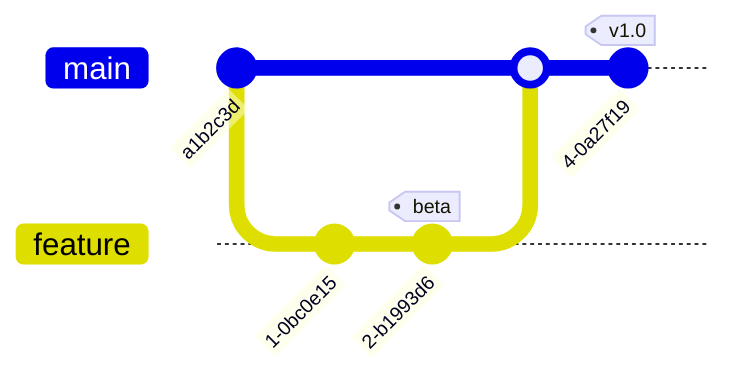
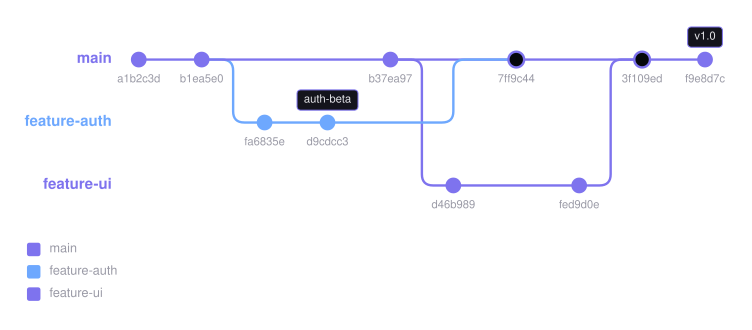

# Git Graph Diagrams

A git graph is a commit history: branches in creation order, commits in operation order, and merge commits that join two parents.


- [Overview](#overview)
- [Format](#format)
- [Builder API](#builder-api)
- [Options](#options)
- [Themes](#themes)
- [Parse](#parse)
- [Debug](#debug)

## Overview

The model lives in `Atelier\Diagram\Git\`: `GitGraph`, `Commit` (`id`, `branch`, optional `tag`, parent ids), and `Branch` (`name`, creation point). All model classes are immutable.

Reach for it to show how work moves across branches over time: a release history, a feature branch merged back into `main`, a hotfix cut from a tag. Use it when the story is the branch topology and merge points, not the sequence of steps (see [flowchart](flowchart.md)) or the states of one subject (see [state diagram](state-diagram.md)).

## Format

Git graphs round-trip through a `gitGraph` subset:



History starts on `main`. `branch` creates a branch at the current tip and checks it out; `checkout` switches branches; `merge` records a merge commit with two parents. Full grammar: [Mermaid support](../mermaid.md#git-graph-subset).

## Builder API

`GitGraphBuilder` (or `Diagram::git()`, which returns it) mirrors git semantics and is the one way to build the model:

```php
use Atelier\Diagram\Diagram;
use Atelier\Diagram\Model\Direction;

$diagram = Diagram::git()
    ->title('Release history')
    ->commit('a1b2c3d')
    ->branch('feature')          // create at current tip + checkout
    ->commit()
    ->commit(tag: 'beta')
    ->checkout('main')
    ->commit()
    ->merge('feature')           // merge commit, two parents
    ->commit(tag: 'v1.0')
    ->build();

Diagram::of($diagram)->saveSvg('history.svg');
```

- `commit($id, $tag)` - records a commit on the current branch. Omitted ids are auto-generated as deterministic 7-character hashes, so identical operation sequences build identical graphs. Duplicate ids throw `InvalidDiagramException`.
- `branch($name)` - creates a branch at the current tip and checks it out, like `git checkout -b`. Existing names throw.
- `checkout($name)` - switches the current branch; unknown names throw.
- `merge($name)` - records a merge commit on the current branch with two parents (current tip first, merged tip second). Merging an unknown branch, a commitless branch, into a commitless branch, or a branch into itself throws.
- `direction($direction)` - `Direction::LeftToRight` (default) or `Direction::TopToBottom`.
- `title($text)` - sets a title (not part of the Mermaid grammar; dropped on serialization).
- `withoutLegend()` - disables the automatic branch-to-color legend (enabled by default).
- `build()` - returns the immutable `GitGraph`.

## Options

| Setting | Default | Effect |
|---|---|---|
| `direction(Direction)` | `LeftToRight` | commit axis; branches become rows, or columns in `TopToBottom` |
| `title(string)` | none | heading; render-only, dropped on serialization |
| `withoutLegend()` | legend shown | removes the branch-to-colour legend; not part of the grammar |

- **Commit id and tag**: `commit($id, $tag)` renders the id as a muted caption under the dot and the tag as a labeled badge.

`Layout\Git\GitLayoutEngine` lays out one lane per branch in creation order, with commits on the axis in operation order at uniform spacing. Edges are straight within a lane and smooth cubic curves across lanes (branch points and merges). Regular commits are filled dots in their branch accent color; merge commits are hollow dots.



The same history built without a title. The heading is optional, and dropping it reclaims its vertical space.

## Themes

Git graphs cycle `accentColors` per branch lane: the first branch takes the first color, the second the next, wrapping when there are more branches than colors. That color fills each branch's commit dots, its lane label, and its legend entry, so a palette with distinct hues reads best. Tag badges use `nodeFillColor` / `nodeStrokeColor`, commit ids use `mutedTextColor`.

All presets apply (`Theme::default()`, `dark()`, `blueprint()`, `mono()`, `neutral()`); `mono()` collapses the lanes to one hue. See [Theming](../theming.md).

## Parse

Header keyword: `gitGraph`.

```php
$diagram = Diagram::fromMermaid($source);        // throws ParseException
$result  = Diagram::tryFromMermaid($source);      // non-throwing ParseResult
```

`toMermaid()` / `toMarkdown()` serialize a built model back; titles and the legend flag are dropped because the grammar has no place for them. Full grammar and round-trip rules: [Mermaid support](../mermaid.md#git-graph-subset).

## Debug

On a rejected source, inspect `ParseResult::getDiagnostic()` (a `ParserDiagnostic` with a message, a stable `code`, and a source span) or catch `ParseException` (`getLineNumber()`, `getSourceLine()`). Render a code frame with `ParserDiagnosticFormatter`:

```php
$result = Diagram::tryFromMermaid($source);
if ($result->isFailure()) {
    echo \Atelier\Diagram\Parser\Support\ParserDiagnosticFormatter::format($result->getDiagnostic());
}
```

See [parser diagnostics](../mermaid.md#debugging).
