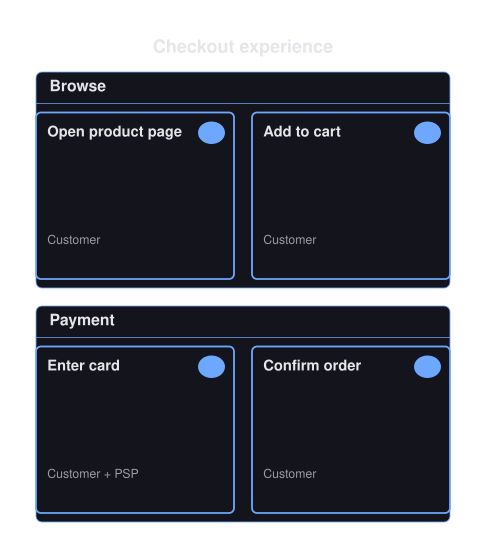
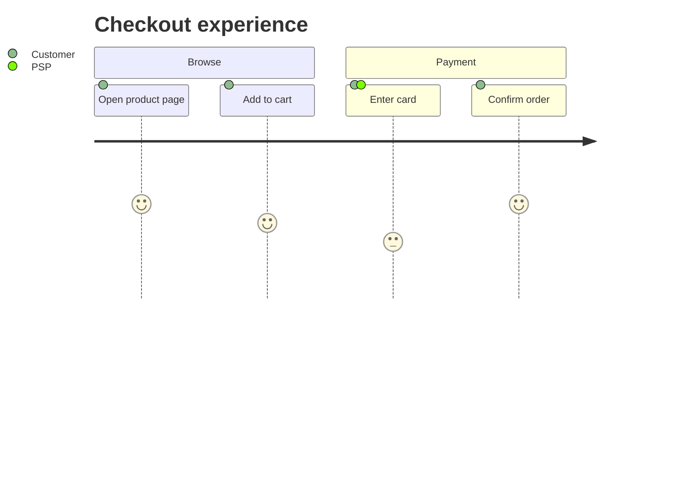
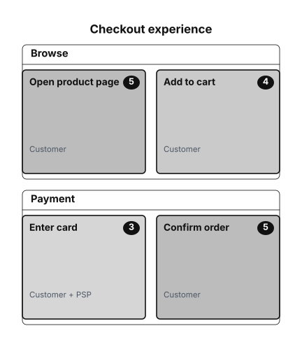

# Journey Diagrams

A journey diagram models a user experience as ordered tasks grouped into sections, each task scored 1 to 5 and attributed to one or more actors.



- [Overview](#overview)
- [Format](#format)
- [Builder API](#builder-api)
- [Options](#options)
- [Themes](#themes)
- [Parse](#parse)
- [Debug](#debug)

## Overview

The model lives in `Atelier\Diagram\Journey\`: `JourneyDiagram` (sections plus an optional `Title`), `JourneySection` (a title and a non-empty list of tasks), `JourneyTask` (`text`, integer `score`, non-empty list of actors), and `JourneyActor` (a name). All model classes are immutable.

Reach for it to trace how a user moves through a flow and how each step feels: a checkout, an onboarding, a support case. It is a diagram type, not a chart type. The score renders as a compact badge and card intensity, without axes, scales, or quantitative plotting. Use a [timeline](timeline-diagram.md) instead when you are ordering events over time rather than scoring experience steps.

## Format



Scores are integers from 1 to 5. A task must belong to a section and must declare at least one actor; multiple actors are comma-separated. Unsupported journey syntax is rejected, never skipped. Full grammar: [Mermaid support](../mermaid.md#journey-diagram-subset).

## Builder API

`JourneyDiagramBuilder` (or `Diagram::journey()`, which returns it) is the one way to build the model:

```php
use Atelier\Diagram\Diagram;

$diagram = Diagram::journey()
    ->title('Checkout experience')
    ->section('Browse')
    ->task('Open product page', 5, ['Customer'])
    ->task('Add to cart', 4, ['Customer'])
    ->section('Payment')
    ->task('Enter card', 3, ['Customer', 'PSP'])
    ->task('Confirm order', 5, ['Customer'])
    ->build();

Diagram::of($diagram)->saveSvg('checkout.svg');
```

- `title($text)` - sets the diagram title.
- `section($title)` - starts a new section lane; throws `InvalidArgumentException` on an empty title.
- `task($text, $score, $actors)` - appends a task to the current section; `$score` is an integer and `$actors` a non-empty list of names. Throws `InvalidArgumentException` when no section has been started.
- `build()` - throws `InvalidArgumentException` when the diagram has no section, or a section has no task.

## Options

| Setting | Default | Effect |
|---|---|---|
| `title(string)` | none | heading above the lanes |
| `Theme::accentColors` | per preset | the first accent washes task cards, at an intensity following the score |

- **Determinism**: layout is source-order based; sections become left-to-right lanes and tasks stack top-to-bottom within a lane, so the same model always yields the same SVG.

`Layout\Journey\JourneyLayoutEngine` renders each section as a vertical lane with a header, then lays its tasks out as source-order cards carrying wrapped task text, a score badge, and compact actor captions.

## Themes

Journey diagrams use `nodeFillColor` (mixed toward `backgroundColor` for the lane body), `nodeStrokeColor` (lane borders and header rule), `textColor` (titles and task text), `mutedTextColor` (actor captions), `backgroundColor` (canvas and score-badge numbers), and the `fontFamily` / `fontSize` pair. Task cards derive their wash and badge from the first `accentColors` entry; the rest of the palette is not used here, so its size does not matter.

All presets apply (`Theme::default()`, `dark()`, `blueprint()`, `mono()`, `neutral()`). See [Theming](../theming.md).



`Theme::mono()` on the same tasks. Scores stay legible without colour, which is what a single-ink preset has to prove.

## Parse

Header keyword: `journey`.

```php
$diagram = Diagram::fromMermaid($source);        // throws ParseException
$result  = Diagram::tryFromMermaid($source);      // non-throwing ParseResult
```

Full grammar and round-trip rules: [Mermaid support](../mermaid.md#journey-diagram-subset).

## Debug

On a rejected source, inspect `ParseResult::getDiagnostic()` (a `ParserDiagnostic` with a message, a stable `code`, and a source span) or catch `ParseException` (`getLineNumber()`, `getSourceLine()`). Render a code frame with `ParserDiagnosticFormatter`:

```php
$result = Diagram::tryFromMermaid($source);
if ($result->isFailure()) {
    echo \Atelier\Diagram\Parser\Support\ParserDiagnosticFormatter::format($result->getDiagnostic());
}
```

See [parser diagnostics](../mermaid.md#debugging).
