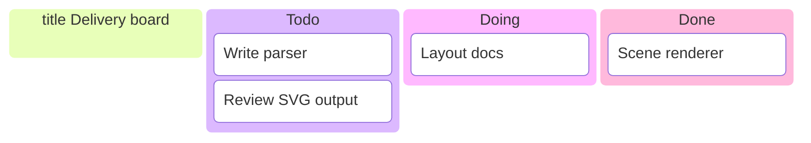
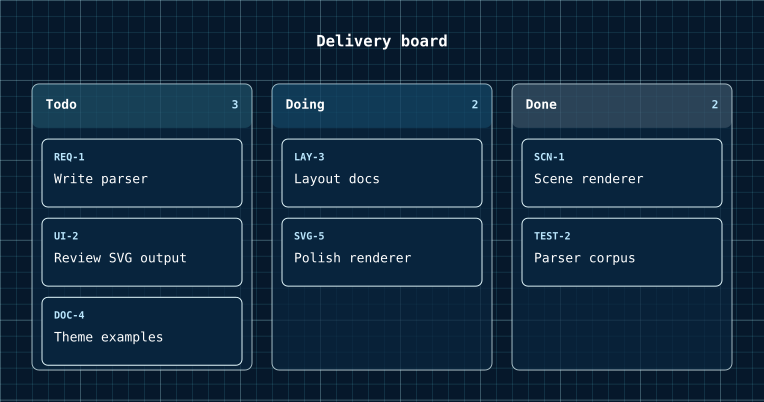

# Kanban Diagrams

A kanban board is a set of ordered columns, each holding an ordered stack of cards laid out left to right in source order.

<figure class="diagram-intro">

<figcaption>Ordered columns containing ordered stacks of cards.</figcaption>
</figure>

- [Overview](#overview)
- [Format](#format)
- [Builder API](#builder-api)
- [Options](#options)
- [Themes](#themes)
- [Parse](#parse)
- [Debug](#debug)

## Overview

The model lives in `Atelier\Diagram\Kanban\`: `KanbanDiagram`, `KanbanColumn` (`id`, `label`, ordered `cards`), and `KanbanCard` (`id`, `label`). All model classes are immutable.

Reach for it to show work items moving across the stages of a workflow: a backlog split into todo, doing, and done, or a review pipeline. Layout preserves source order and never sorts, balances, or applies WIP limits. Use a [flowchart](flowchart.md) instead when you need to show transitions between stages rather than the items parked in each one.

## Format

Kanban round-trips through a `kanban` subset. Indentation is strict: 4 spaces for the title and columns, 8 spaces for cards.



Ids match `[A-Za-z_][A-Za-z0-9_-]*`, so issue-like ids such as `REQ-1` are accepted. Labels are the bracket text and cannot contain `]`. Tabs, other indentation widths, WIP limits, assignees, tags, and markdown labels are rejected, never skipped. Full grammar: [Mermaid support](../mermaid.md#kanban-subset).

## Builder API

`KanbanDiagramBuilder` (or `Diagram::kanban()`, which returns it) is the one way to build the model:

```php
use Atelier\Diagram\Diagram;

$diagram = Diagram::kanban()
    ->title('Delivery board')
    ->column('todo', 'Todo')                  // declare a column
    ->card('todo', 'REQ-1', 'Write parser')   // add a card to a column
    ->card('todo', 'UI-2', 'Review SVG output')
    ->column('doing', 'Doing')
    ->card('doing', 'LAY-3', 'Layout docs')
    ->column('done', 'Done')
    ->card('done', 'SCN-1', 'Scene renderer')
    ->build();

Diagram::of($diagram)->saveSvg('kanban.svg');
```

`title()`
: Sets a title. It is dropped during serialization because the Mermaid grammar has no place for it.

  | Argument | Type | Description |
  |---|---|---|
  | `$text` | `string` | Non-empty title. |

`column()`
: Declares a column. Empty labels and duplicate ids throw.

  | Argument | Type | Description |
  |---|---|---|
  | `$id` | `string` | Unique column identifier. |
  | `$label` | `string` | Display label. |

`card()`
: Appends a card to an existing column. Unknown columns and duplicate card ids throw.

  | Argument | Type | Description |
  |---|---|---|
  | `$columnId` | `string` | Existing column identifier. |
  | `$id` | `string` | Unique card identifier. |
  | `$label` | `string` | Card label. |

`build()`
: Assembles the immutable `KanbanDiagram`. A diagram without columns throws.

## Options

| Setting | Default | Effect |
|---|---|---|
| `title(string)` | none | heading above the board; builder-only, dropped on serialization |
| `Theme::spacingUnit` | per preset | lane width, gaps, header height, card padding |
| `Theme::fontSize` | per preset | card and header text size |

- **Order**: layout is source-order based and deterministic. Columns run left to right, cards top to bottom, in declaration order. There is no sorting or balancing.
- **Card wrapping**: card labels wrap into multiple text lines when they exceed the card content width; column width is fixed.

`Layout\Kanban\KanbanLayoutEngine` renders columns as fixed-width lanes with a tinted header showing the label and card count, then stacks cards with a stable gap.

## Themes

Kanban uses `accentColors` per column: each column takes the next accent (cycled by index) as its header tint, so a larger palette gives more distinct columns. Lanes and cards use `nodeFillColor` and `nodeStrokeColor`, labels use `textColor`, and card ids and column counts use `mutedTextColor`.

All presets apply (`Theme::default()`, `dark()`, `blueprint()`, `mono()`, `neutral()`); `mono()` collapses the per-column accents to one tone. See [Theming](../theming.md).



`Theme::blueprint()` changes the palette while preserving the board's column widths.

## Parse

Header keyword: `kanban`.

```php
$diagram = Diagram::fromMermaid($source);        // throws ParseException
$result  = Diagram::tryFromMermaid($source);      // non-throwing ParseResult
```

`toMermaid()` / `toMarkdown()` serialize a built model back; titles are dropped because the grammar has no place for them. Full grammar and round-trip rules: [Mermaid support](../mermaid.md#kanban-subset).

## Debug

On a rejected source, inspect `ParseResult::getDiagnostic()` (a `ParserDiagnostic` with a message, a stable `code`, and a source span) or catch `ParseException` (`getLineNumber()`, `getSourceLine()`). Render a code frame with `ParserDiagnosticFormatter`:

```php
$result = Diagram::tryFromMermaid($source);
if ($result->isFailure()) {
    echo \Atelier\Diagram\Parser\Support\ParserDiagnosticFormatter::format($result->getDiagnostic());
}
```

See [parser diagnostics](../mermaid.md#debugging).
