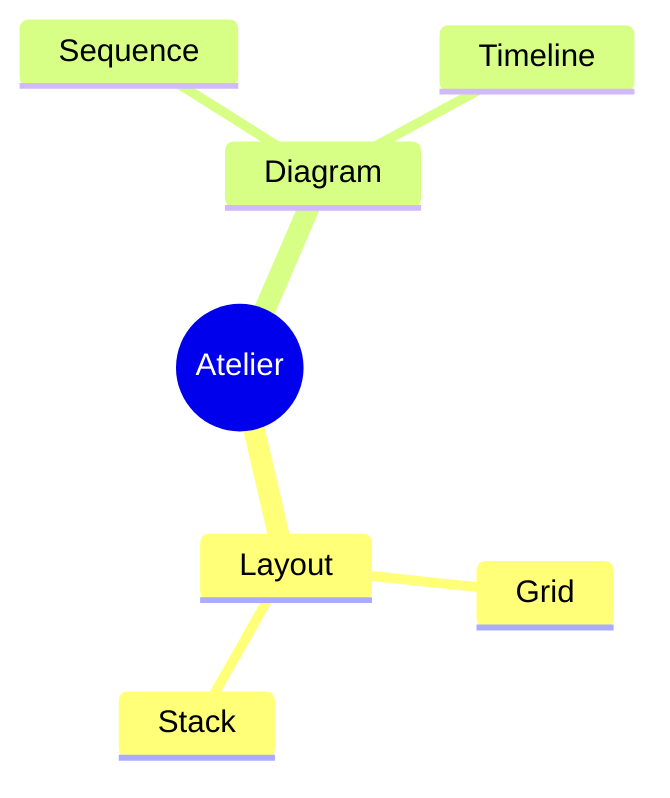
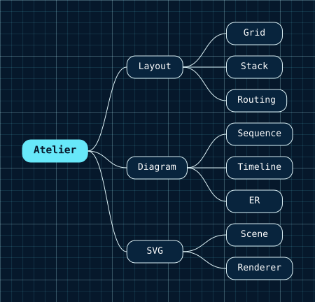

# Mindmap Diagrams

A mindmap is one rooted tree: a central idea, its branches, and the child nodes stacked beneath them.


- [Overview](#overview)
- [Format](#format)
- [Builder API](#builder-api)
- [Options](#options)
- [Themes](#themes)
- [Parse](#parse)
- [Debug](#debug)

## Overview

The model lives in `Atelier\Diagram\Mindmap\`: `MindmapDiagram` (wraps a single `root` node) and `MindmapNode` (`id`, `label`, and a list of child `MindmapNode`s). Both are immutable value objects. There is exactly one root, and every node reaches the root through its parents.

Reach for it to decompose one idea into a hierarchy: a package surface, a product's capabilities, parser coverage, a roadmap. Use a [flowchart](flowchart.md) instead when you need edges between arbitrary nodes rather than a strict parent-child tree.

## Format

Mindmaps round-trip through a `mindmap` subset:



Indentation is semantic: spaces only (tabs are rejected), exactly two spaces per level, and exactly one root. `root((Text))` is accepted only on the root; every other node is a plain label. Full grammar: [Mermaid support](../mermaid.md#mindmap-subset).

## Builder API

`MindmapDiagramBuilder` (or `Diagram::mindmap()`, which returns it) is the one way to build the model:

```php
use Atelier\Diagram\Diagram;

$diagram = Diagram::mindmap()
    ->root('Atelier', 'root')           // the single root; id optional
    ->child('root', 'Layout', 'layout') // child of an existing parent id
    ->child('layout', 'Grid')
    ->child('layout', 'Stack')
    ->child('root', 'Diagram', 'diagram')
    ->child('diagram', 'Sequence')
    ->child('diagram', 'Timeline')
    ->build();

Diagram::of($diagram)->saveSvg('mindmap.svg');
```

- `root($label, $id = null)` - sets the single root. The id is auto-generated when omitted. Throws `InvalidArgumentException` if a root already exists, or if the label is empty.
- `child($parentId, $label, $id = null)` - adds a node under an existing parent id (declaration order is the stacking order). The id is auto-generated when omitted. Throws `InvalidArgumentException` when the parent is unknown, the label is empty, or the id is a duplicate.
- `build()` - throws `InvalidArgumentException` when no root was declared.

## Options

| Setting | Default | Effect |
|---|---|---|
| `Theme::spacingUnit` | per preset | column gap, row gap, padding, node height, corner radius |
| `Theme::fontSize` | per preset | label size; the root renders at 1.12x |
| `Theme::strokeWidth` | per preset | box and connector stroke |

This type has no direction or title knob: the tree always lays out left to right.

There is no direction or title knob: the tree always lays out left-to-right and the layout is deterministic (source order fixes child stacking, so the same model always yields the same SVG). Sizing follows `Theme`: `spacingUnit` drives the column gap, row gap, padding, node height, and corner radius; `fontSize` sizes labels (the root at 1.12x); `strokeWidth` sets box and connector stroke. Node width fits the measured label with a floor of `10 * spacingUnit`. The canvas is at least 420 x 260.

`Layout\Mindmap\MindmapLayoutEngine` assigns each depth a column, stacks children within their parent's subtree height, and draws cubic-curve connectors from each parent's right edge to each child's left edge. Nodes are rounded-rectangle pills, not circles; the root renders larger and bold.

## Themes

`accentColors` is indexed by depth, cycled with a modulo so it never overflows the palette. In the current layout only the root (depth 0, so `accentColors[0]`) uses its accent, filled and stroked with it and given white label text. Deeper nodes render with `nodeFillColor` and `nodeStrokeColor`, `textColor` labels, and `nodeStrokeColor` connectors.

All presets apply (`Theme::default()`, `dark()`, `blueprint()`, `mono()`, `neutral()`). See [Theming](../theming.md).



`Theme::blueprint()` on the same tree. Branch colours cycle through `accentColors` by depth.

## Parse

Header keyword: `mindmap`.

```php
$diagram = Diagram::fromMermaid($source);        // throws ParseException
$result  = Diagram::tryFromMermaid($source);      // non-throwing ParseResult
```

The parser uses strict indentation: spaces only, exactly two per level, one root, no skipped levels. Icons, classes, Markdown labels, arbitrary shapes, and multiple roots are rejected, never skipped. Full grammar and round-trip rules: [Mermaid support](../mermaid.md#mindmap-subset).

## Debug

On a rejected source, inspect `ParseResult::getDiagnostic()` (a `ParserDiagnostic` with a message, a stable `code`, and a source span) or catch `ParseException` (`getLineNumber()`, `getSourceLine()`). Render a code frame with `ParserDiagnosticFormatter`:

```php
$result = Diagram::tryFromMermaid($source);
if ($result->isFailure()) {
    echo \Atelier\Diagram\Parser\Support\ParserDiagnosticFormatter::format($result->getDiagnostic());
}
```

See [parser diagnostics](../mermaid.md#debugging).
