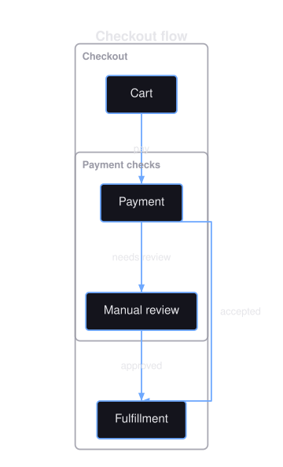
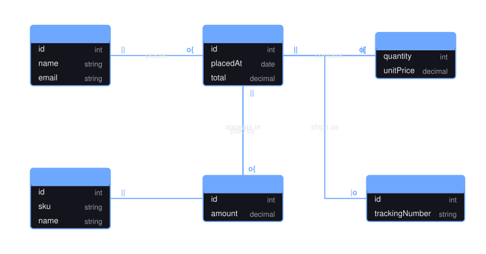
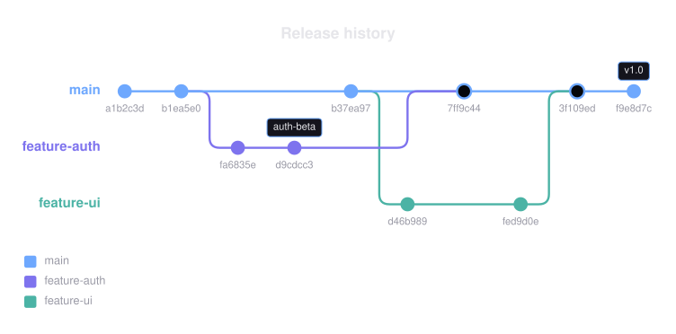
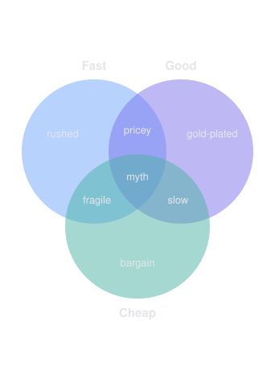
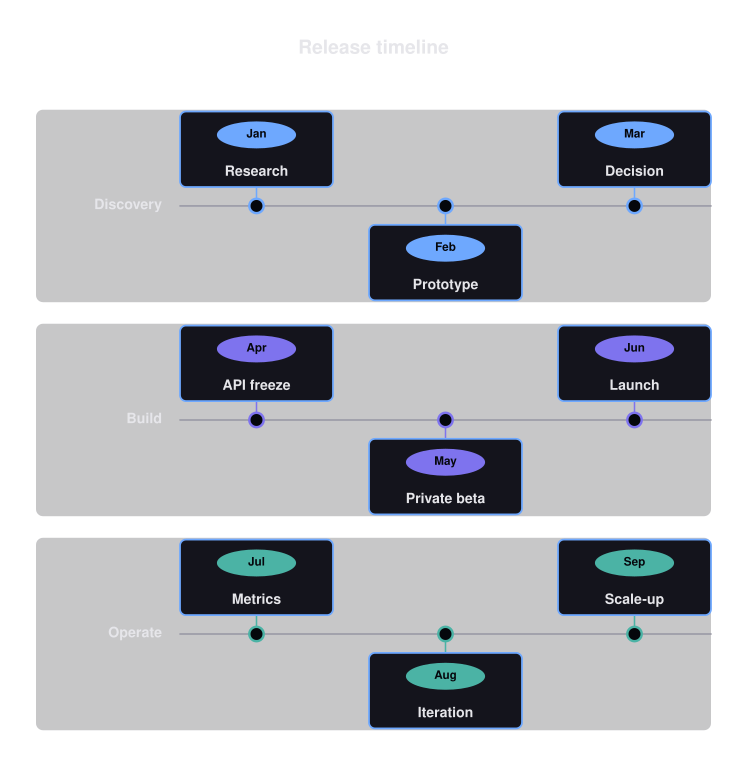
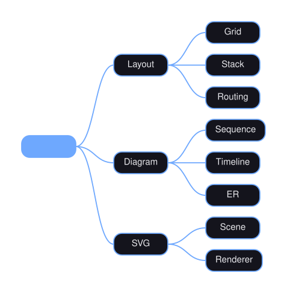
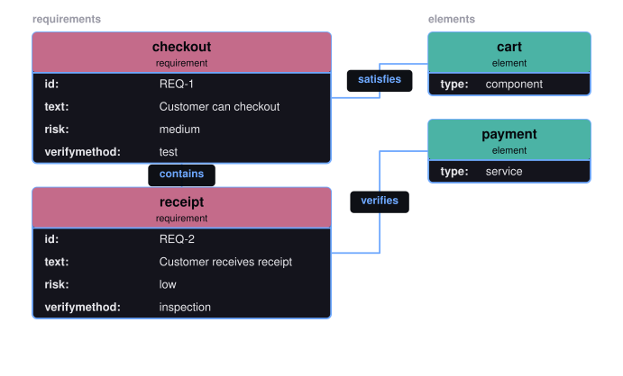
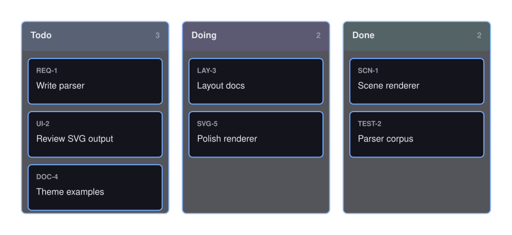
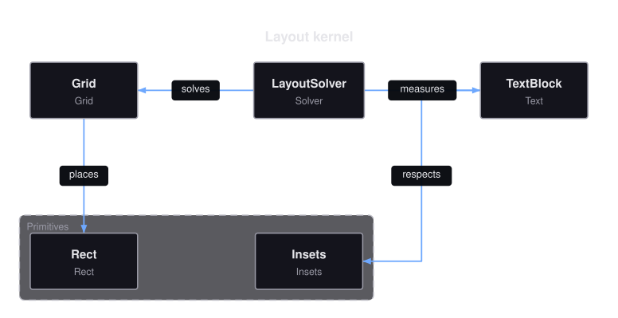
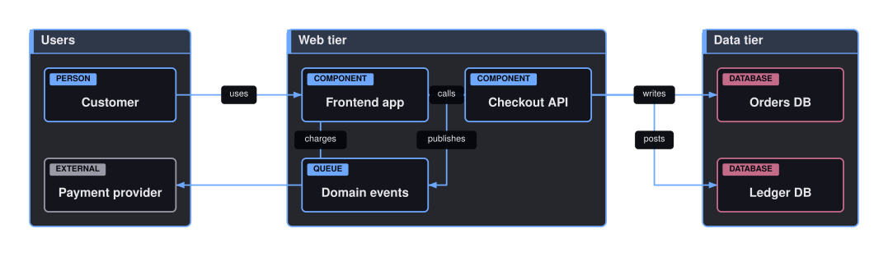

# Every Diagram Type

Fifteen types, each with a fluent PHP builder, a layout engine, and an SVG renderer. All of them except Venn also parse a Mermaid subset and render canonical Mermaid back.

Every figure below is generated from the type's own documented example, so what you see is what the code in that page produces.

<figure><figcaption><a href="flowchart.md">Flowchart</a></figcaption></figure>
<figure><figcaption><a href="state-diagram.md">State</a></figcaption></figure>
<figure><figcaption><a href="sequence-diagram.md">Sequence</a></figcaption></figure>
<figure><figcaption><a href="class-diagram.md">Class</a></figcaption></figure>
<figure><figcaption><a href="er-diagram.md">ER</a></figcaption></figure>
<figure><figcaption><a href="git-graph.md">Git graph</a></figcaption></figure>
<figure><figcaption><a href="venn-diagram.md">Venn</a></figcaption></figure>
<figure><figcaption><a href="timeline-diagram.md">Timeline</a></figcaption></figure>
<figure><figcaption><a href="journey-diagram.md">Journey</a></figcaption></figure>
<figure><figcaption><a href="mindmap-diagram.md">Mindmap</a></figcaption></figure>
<figure><figcaption><a href="requirement-diagram.md">Requirement</a></figcaption></figure>
<figure><figcaption><a href="kanban-diagram.md">Kanban</a></figcaption></figure>
<figure><figcaption><a href="block-diagram.md">Block</a></figcaption></figure>
<figure><figcaption><a href="architecture-diagram.md">Architecture</a></figcaption></figure>
<figure><figcaption><a href="c4-diagram.md">C4</a></figcaption></figure>

## Which One Parses Mermaid

Fourteen of the fifteen accept a Mermaid subset. Venn has none, because Mermaid itself has no Venn diagram: it is built through the PHP builder only.

Each type page names its header keyword and links the exact grammar it accepts. The full table lives in [Mermaid support](../mermaid.md).
