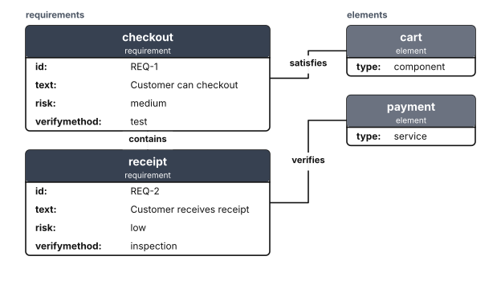

# Requirement Diagrams

A requirement diagram is a small SysML-like view: requirement blocks, implementation or verification elements, and typed relationships between them.

<figure class="diagram-intro">

<figcaption>Requirements, implementation elements, and typed relationships.</figcaption>
</figure>

- [Overview](#overview)
- [Format](#format)
- [Builder API](#builder-api)
- [Options](#options)
- [Themes](#themes)
- [Parse](#parse)
- [Debug](#debug)

## Overview

The model lives in `Atelier\Diagram\Requirement\`: `RequirementDiagram` (the nodes and relationships), `RequirementNode` (`id`, `kind`, ordered `fields`), `RequirementNodeKind` (`Requirement` or `Element`), `RequirementRelationship` (`from`, `to`, `kind`), and `RequirementRelationshipKind`. All model classes are immutable.

Reach for it to show which parts of a system satisfy, verify, or derive from which requirements: a checkout requirement satisfied by a cart component, a safety requirement verified by a test. This is a strict subset, not full SysML: no nested packages, no formal type taxonomy, no generated ids.

## Format

Requirement diagrams round-trip through a `requirementDiagram` subset:

```mermaid
requirementDiagram
    requirement checkout {
        id: REQ-1
        text: Customer can checkout
        risk: medium
        verifymethod: test
    }
    element cart {
        type: component
    }
    cart - satisfies -> checkout
```

A `requirement id { ... }` or `element id { ... }` block declares a node; `key: value` lines inside it are fields kept in declaration order. A `source - kind -> target` line declares a typed relationship. Relationship kinds are `contains`, `copies`, `derives`, `satisfies`, `verifies`, `refines`, and `traces`. Node ids match `[A-Za-z_][A-Za-z0-9_]*`, field names match `[A-Za-z][A-Za-z0-9_]*`, and field values are plain single-line text. Full grammar: [Mermaid support](../mermaid.md#requirement-diagram-subset).

## Builder API

`RequirementDiagramBuilder` (or `Diagram::requirement()`, which returns it) is the one way to build the model:

```php
use Atelier\Diagram\Diagram;

$diagram = Diagram::requirement()
    ->requirement('checkout', [
        'id' => 'REQ-1',
        'text' => 'Customer can checkout',
        'risk' => 'medium',
        'verifymethod' => 'test',
    ])
    ->element('cart', [
        'type' => 'component',
    ])
    ->relationship('cart', 'satisfies', 'checkout')
    ->build();

Diagram::of($diagram)->saveSvg('requirements.svg');
```

`requirement()` / `element()`
: Declares a node of the selected kind with an optional field map. Re-declaration merges fields; changing an existing node's kind throws.

  | Argument | Type | Description |
  |---|---|---|
  | `$id` | `string` | Unique node identifier. |
  | `$fields` | `array<string, string>` | Initial fields; defaults to an empty map. |

`node()`
: Calls the generic form behind `requirement()` and `element()`.

  | Argument | Type | Description |
  |---|---|---|
  | `$id` | `string` | Unique node identifier. |
  | `$kind` | `RequirementNodeKind\|string` | Node kind enum case or keyword. |
  | `$fields` | `array<string, string>` | Initial fields; defaults to an empty map. |

`field()`
: Adds or replaces one field on a declared node. Unknown nodes, invalid names, and empty values throw.

  | Argument | Type | Description |
  |---|---|---|
  | `$nodeId` | `string` | Existing node identifier. |
  | `$name` | `string` | Field name. |
  | `$value` | `string` | Non-empty field value. |

`relationship()`
: Adds a typed relationship between nodes.

  | Argument | Type | Description |
  |---|---|---|
  | `$from` | `string` | Source node identifier. |
  | `$kind` | `RequirementRelationshipKind\|string` | Relationship enum case or keyword. |
  | `$to` | `string` | Target node identifier. |

`build()`
: Assembles the immutable `RequirementDiagram`; fields retain declaration order.

## Options

| Setting | Default | Effect |
|---|---|---|
| `Theme::spacingUnit` | per preset | node padding, row height, inter-node gaps, and a field-value cap of `20 * spacingUnit` |

This type has no direction or title knob: the two-column grouping is fixed.

- **Field-value width**: field values wrap to a measured cap (`20 * Theme::spacingUnit`), so long text stacks into extra rows rather than widening a box.
- **Determinism**: layout is source-order based and deterministic; the same model always yields the same SVG.

`Layout\Requirement\RequirementLayoutEngine` groups requirement nodes and element nodes into two labelled vertical stacks, sizes each box to its title, kind band, and key/value rows, then routes relationships orthogonally between boxes with the relationship kind as a label over a halo.

## Themes

Requirement diagrams use `accentColors` for the header band of each box: requirement boxes take `accentColors[4]`, element boxes take `accentColors[2]` (wrapped modulo the palette size), so a palette of at least five colors keeps the two kinds visually distinct. The title and kind text on that band are white. Box bodies use `nodeFillColor` and `nodeStrokeColor` with `strokeWidth`, field text uses `textColor`, and the group labels use `mutedTextColor`.

All presets apply (`Theme::default()`, `dark()`, `blueprint()`, `mono()`, `neutral()`); with `mono()` the two kinds converge toward one accent. See [Theming](../theming.md).



`Theme::mono()` on the same requirements. Relationship kinds are drawn by line style rather than colour, so they survive a single-ink theme.

## Parse

Header keyword: `requirementDiagram`.

```php
$diagram = Diagram::fromMermaid($source);        // throws ParseException
$result  = Diagram::tryFromMermaid($source);      // non-throwing ParseResult
```

`toMermaid()` / `toMarkdown()` serialize a built model back. Full grammar and round-trip rules: [Mermaid support](../mermaid.md#requirement-diagram-subset).

## Debug

On a rejected source, inspect `ParseResult::getDiagnostic()` (a `ParserDiagnostic` with a message, a stable `code`, and a source span) or catch `ParseException` (`getLineNumber()`, `getSourceLine()`). Render a code frame with `ParserDiagnosticFormatter`:

```php
$result = Diagram::tryFromMermaid($source);
if ($result->isFailure()) {
    echo \Atelier\Diagram\Parser\Support\ParserDiagnosticFormatter::format($result->getDiagnostic());
}
```

See [parser diagnostics](../mermaid.md#debugging).
