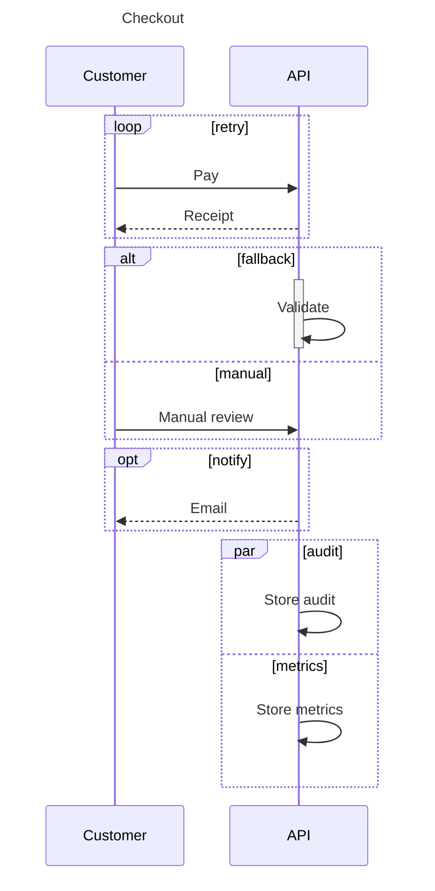

# Sequence Diagrams

A sequence diagram is a set of participants and the ordered messages exchanged between them over time, with optional activation bars and grouping blocks.


- [Overview](#overview)
- [Format](#format)
- [Builder API](#builder-api)
- [Options](#options)
- [Themes](#themes)
- [Parse](#parse)
- [Debug](#debug)

## Overview

The model lives in `Atelier\Diagram\Sequence\`: `SequenceDiagram`, `Participant` (`id`, `label` defaulting to the id), `Message` (`from`, `to`, `label`, `arrow`), `SequenceBlock` (a `SequenceBlockKind` grouping a range of messages, with optional `SequenceBlockBranch` branches), and `SequenceActivation` (an activation bar spanning a message range). Arrows are the `MessageArrow` enum, block kinds the `SequenceBlockKind` enum. All model classes are immutable.

Reach for it to show a conversation ordered in time: a client and a server exchanging requests and replies, a checkout flow across services, a handshake. Use a [flowchart](flowchart.md) instead when the order is branching logic rather than messages, or a [state diagram](state-diagram.md) when you track one subject through its states.

## Format

Sequence diagrams round-trip through a `sequenceDiagram` subset:



`->>` is a solid message, `-->>` a dashed reply. `loop` / `alt` / `opt` / `par` blocks close with `end`; `else` and `and` separate branches inside `alt` and `par`. `activate` / `deactivate` draw an activation bar. Messages auto-declare unknown participants. Nested blocks, actors, notes, autonumber, and destruction markers are rejected, never skipped. Full grammar: [Mermaid support](../mermaid.md#sequence-diagram-subset).

## Builder API

`SequenceDiagramBuilder` (or `Diagram::sequence()`, which returns it) is the one way to build the model:

```php
use Atelier\Diagram\Diagram;
use Atelier\Diagram\Sequence\MessageArrow;

$diagram = Diagram::sequence()
    ->title('Checkout')
    ->participant('User', 'Customer')           // id + display label
    ->participant('Api', 'API')
    ->message('User', 'Api', 'Pay')             // solid arrow
    ->message('Api', 'User', 'Receipt', MessageArrow::Dashed)
    ->message('Api', 'Api', 'Validate')         // self-message
    ->build();

Diagram::of($diagram)->saveSvg('checkout.svg');
```

- `title($text)` - sets a title (serialized to Mermaid, unlike most other types).
- `participant($id, $label)` - declares a participant; the label defaults to the id. Re-declaring an id throws.
- `message($from, $to, $label, $arrow)` - adds a message and auto-declares unknown endpoints with the id as label (Mermaid behavior). `$arrow` is `MessageArrow::Solid` (default) or `MessageArrow::Dashed`.
- `block($kind, $label, $firstMessageIndex, $lastMessageIndex, $branches)` - groups a range of messages by their indices under a `SequenceBlockKind` (`Loop`, `Alt`, `Opt`, `Par`), with optional `SequenceBlockBranch` list.
- `activate($participant)` / `deactivate($participant)` - open and close an activation bar. `activate` must follow a message and throws if the participant is already active; `deactivate` throws if it is not active. Bars still open at `build()` are closed at the last message.
- `messageCount()` - returns the number of messages added so far (useful for computing block index ranges).
- `build()` - throws `InvalidArgumentException` when no participant was declared.

## Options

| Setting | Default | Effect |
|---|---|---|
| `title(string)` | none | heading; survives serialization, unlike most types |
| `block(kind, label, first, last, branches)` | none | frames a contiguous message range; branches split it |
| `activate()` / `deactivate()` | none | activation bars over a lifeline |

- **Determinism**: layout is source-order based and deterministic; the same model always yields the same SVG.

`Layout\Sequence\SequenceLayoutEngine` solves participant tracks with `atelier/layout`, then draws headers, dotted lifelines, block spans, message rows with labels and arrowheads, and self-message loops into the shared `Scene` IR. Dashed messages use a dashed line; self-messages draw a small loop back to the same lifeline.

## Themes

Sequence diagrams use `nodeFillColor` and `nodeStrokeColor` for participant headers and activation bars, `nodeStrokeColor` for message lines and arrowheads, `mutedTextColor` for lifelines and block frames, `textColor` for message labels, and `backgroundColor` behind label halos. They do **not** use `accentColors` (every participant and message is styled uniformly), so the palette size does not matter here. Block frames are unfilled outlines stroked with `mutedTextColor`, so they sit cleanly on any preset.

All presets apply (`Theme::default()`, `dark()`, `blueprint()`, `mono()`, `neutral()`); no `Scene\BackgroundPattern` is drawn for this type. See [Theming](../theming.md).


`Theme::mono()`: a single ink, no accent cycle. Useful when the output is going to be printed or embedded in a document that owns its own colours.

## Parse

Header keyword: `sequenceDiagram`.

```php
$diagram = Diagram::fromMermaid($source);        // throws ParseException
$result  = Diagram::tryFromMermaid($source);      // non-throwing ParseResult
```

`toMermaid()` / `toMarkdown()` serialize a built model back. Sequence titles are serialized (unlike state and most other types). Blocks and activations round-trip canonically. Full grammar and round-trip rules: [Mermaid support](../mermaid.md#sequence-diagram-subset).

## Debug

On a rejected source, inspect `ParseResult::getDiagnostic()` (a `ParserDiagnostic` with a message, a stable `code`, and a source span) or catch `ParseException` (`getLineNumber()`, `getSourceLine()`). Render a code frame with `ParserDiagnosticFormatter`:

```php
$result = Diagram::tryFromMermaid($source);
if ($result->isFailure()) {
    echo \Atelier\Diagram\Parser\Support\ParserDiagnosticFormatter::format($result->getDiagnostic());
}
```

See [parser diagnostics](../mermaid.md#debugging).
