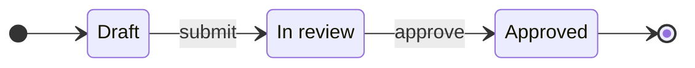
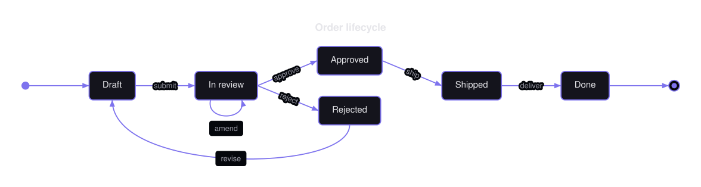

# State Diagrams

A state diagram is a set of named states and the labeled transitions between them, plus the initial and final pseudo-states.

<figure class="diagram-intro">

<figcaption>States connected by labeled transitions and terminal nodes.</figcaption>
</figure>

- [Overview](#overview)
- [Format](#format)
- [Builder API](#builder-api)
- [Options](#options)
- [Themes](#themes)
- [Parse](#parse)
- [Debug](#debug)

## Overview

The model lives in `Atelier\Diagram\State\`: `StateDiagram`, `State` (`id`, `label` defaulting to the id), and `Transition` (`from`, `to`, optional label). All model classes are immutable.

Reach for it to show a lifecycle or workflow where a subject moves between discrete states: an order moving from draft to fulfilled, a document through review, a connection through its handshake. Use a [flowchart](flowchart.md) instead when you are modeling process steps and decisions rather than the states of a single subject.

## Format

State diagrams round-trip through a `stateDiagram-v2` subset:



State ids match `[A-Za-z_][A-Za-z0-9_]*`. Composite `state { }` blocks, forks, joins, notes, and concurrency are rejected, never skipped. Full grammar: [Mermaid support](../mermaid.md#state-diagram-subset).

## Builder API

`StateDiagramBuilder` (or `Diagram::state()`, which returns it) is the one way to build the model:

```php
use Atelier\Diagram\Diagram;
use Atelier\Diagram\Model\Direction;

$diagram = Diagram::state()
    ->direction(Direction::LeftToRight)
    ->title('Order lifecycle')
    ->state('Review', 'In review')              // id + display label
    ->initial('Draft')                          // [*] --> Draft
    ->transition('Draft', 'Review', 'submit')
    ->transition('Review', 'Review', 'amend')   // self-transition
    ->transition('Review', 'Draft', 'reject')
    ->transition('Review', 'Approved', 'approve')
    ->final('Approved')                         // Approved --> [*]
    ->build();

Diagram::of($diagram)->saveSvg('order.svg');
```

`state()`
: Declares a state. Re-declaring it with a label replaces that label; without one it is a no-op.

  | Argument | Type | Description |
  |---|---|---|
  | `$id` | `string` | State identifier. |
  | `$label` | `?string` | Display label; defaults to `$id`. |

`transition()`
: Adds a transition and auto-declares unknown endpoints. Declaration order is the layout tie-breaker.

  | Argument | Type | Description |
  |---|---|---|
  | `$from` | `string` | Source state identifier. |
  | `$to` | `string` | Target state identifier. |
  | `$label` | `?string` | Optional transition label. |

`initial()` / `final()`
: Adds a transition from or to the reserved pseudo-state. Reserved ids cannot be regular states.

  | Argument | Type | Description |
  |---|---|---|
  | `$to` / `$from` | `string` | State connected to the pseudo-state. |

`direction()`
: Sets the flow direction.

  | Argument | Type | Description |
  |---|---|---|
  | `$direction` | `Direction` | `TopToBottom` by default, or `LeftToRight`. |

`title()`
: Sets a title. It is dropped during serialization because the Mermaid grammar has no place for it.

  | Argument | Type | Description |
  |---|---|---|
  | `$title` | `string` | Non-empty title. |

`build()`
: Assembles the immutable `StateDiagram`. A diagram without states throws.

## Options

| Setting | Default | Effect |
|---|---|---|
| `direction(Direction)` | `TopToBottom` | ranks states as rows or as columns |
| `title(string)` | none | heading above the diagram |
| `Theme::minNodeWidth` / `minNodeHeight` | `null` | floor for state boxes, so a row of states reads evenly |

- **Determinism**: layout is source-order based and deterministic; the same model always yields the same SVG.

`Layout\State\StateLayoutEngine` ranks states by longest path from the initial/source states (breaking cycles by ignoring back edges), runs a few barycenter sweeps to reduce crossings, then places ranks as rows or columns. States render as rounded rectangles, the initial pseudo-state as a small filled circle, the final one as a double circle. Edges are straight between adjacent ranks, bowed for back edges and long spans, small arcs for self-loops, with labels over a background halo.



`direction(Direction::LeftToRight)` on the same states and transitions. Direction is a layout decision, so the graph is unchanged and only its shape moves.

## Themes

State diagrams use `nodeFillColor` and `nodeStrokeColor` for the state boxes, `nodeStrokeColor` for edges and the pseudo-states, `textColor` for labels, and `mutedTextColor` for edge-label halos.

All presets apply (`Theme::default()`, `dark()`, `blueprint()`, `mono()`, `neutral()`), and a `Scene\BackgroundPattern` (as in `blueprint()`) sits behind the states. See [Theming](../theming.md).

## Parse

Header keyword: `stateDiagram-v2` (or `stateDiagram`).

```php
$diagram = Diagram::fromMermaid($source);        // throws ParseException
$result  = Diagram::tryFromMermaid($source);      // non-throwing ParseResult
```

`toMermaid()` / `toMarkdown()` serialize a built model back; titles are dropped because the grammar has no place for them. Full grammar and round-trip rules: [Mermaid support](../mermaid.md#state-diagram-subset).

## Debug

On a rejected source, inspect `ParseResult::getDiagnostic()` (a `ParserDiagnostic` with a message, a stable `code`, and a source span) or catch `ParseException` (`getLineNumber()`, `getSourceLine()`). Render a code frame with `ParserDiagnosticFormatter`:

```php
$result = Diagram::tryFromMermaid($source);
if ($result->isFailure()) {
    echo \Atelier\Diagram\Parser\Support\ParserDiagnosticFormatter::format($result->getDiagnostic());
}
```

See [parser diagnostics](../mermaid.md#debugging).
