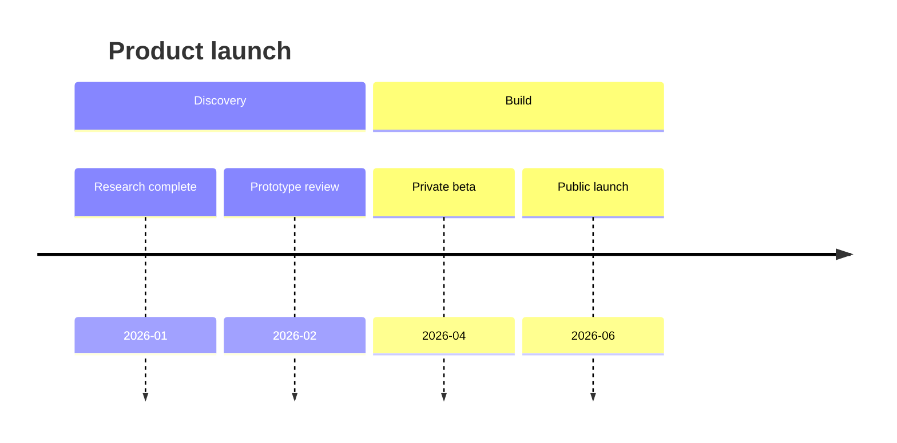
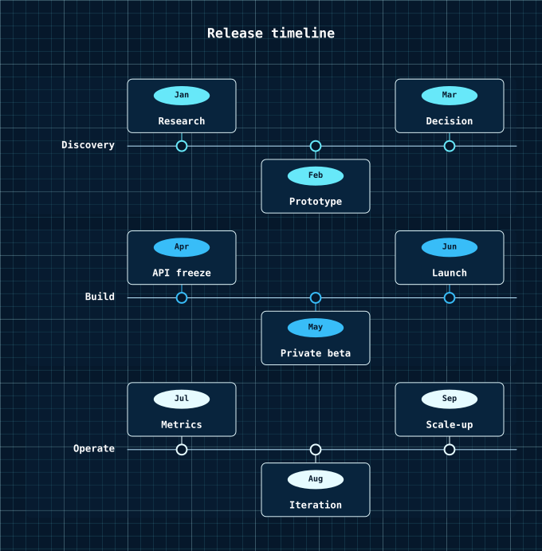

# Timeline Diagrams

A timeline is a sequence of events grouped into named sections, drawn as one horizontal lane per section along a shared axis.

<figure class="diagram-intro">

<figcaption>Dated events organized into chronological sections.</figcaption>
</figure>

- [Overview](#overview)
- [Format](#format)
- [Builder API](#builder-api)
- [Options](#options)
- [Themes](#themes)
- [Parse](#parse)
- [Debug](#debug)

## Overview

The model lives in `Atelier\Diagram\Timeline\`: `TimelineDiagram` (sections plus an optional `Title`), `TimelineSection` (`title`, a non-empty list of events), and `TimelineEvent` (`label`, `date`). All model classes are immutable.

Reach for it to show ordered events grouped into lanes: product plans, release narratives, incident reviews, and project phases. Use it when the point is "what happened in which lane" rather than a charted date scale. Dates are rendered as labels; they are not parsed or scaled onto a calendar axis.

## Format



`title` is optional. Every event must belong to an explicit `section`, and each event line is `Label : date`. The date is a free-text label, not a parsed value. Unsupported Mermaid timeline features are rejected, never skipped. Full grammar: [Mermaid support](../mermaid.md#timeline-subset).

## Builder API

`TimelineDiagramBuilder` (or `Diagram::timeline()`, which returns it) is the one way to build the model:

```php
use Atelier\Diagram\Diagram;

$diagram = Diagram::timeline()
    ->title('Product launch')
    ->section('Discovery')
    ->event('Research complete', '2026-01')
    ->event('Prototype review', '2026-02')
    ->section('Build')
    ->event('Private beta', '2026-04')
    ->event('Public launch', '2026-06')
    ->build();

Diagram::of($diagram)->saveSvg('out.svg');
```

`title()`
: Sets an optional diagram title.

  | Argument | Type | Description |
  |---|---|---|
  | `$text` | `string` | Non-empty title. |

`section()`
: Starts a new lane. An empty title throws.

  | Argument | Type | Description |
  |---|---|---|
  | `$title` | `string` | Section title. |

`event()`
: Adds an event to the current section. Calling it before `section()` throws; the date remains a display label.

  | Argument | Type | Description |
  |---|---|---|
  | `$label` | `string` | Event label. |
  | `$date` | `string` | Displayed date label. |

`build()`
: Assembles the immutable `TimelineDiagram`. Missing sections and empty sections throw.

## Options

| Setting | Default | Effect |
|---|---|---|
| `title(string)` | none | centered heading above the lanes |
| `Theme::minNodeWidth` | `null` | floor for event cards, alongside `17 * spacingUnit` |
| `Theme::spacingUnit` | per preset | card width floor, lane spacing, padding |

- **Determinism**: sections and events are drawn in source order with equal spacing; the same model always yields the same SVG.

`Layout\Timeline\TimelineLayoutEngine` stacks one horizontal lane per section against a shared axis. Each section keeps its own color, drawn as a filled connector dot on the axis with a stem to the event card. Dates are rendered as labels only; there is no calendar scale, duration math, or range bars.

## Themes

Timelines use `accentColors` per section: section index `n` takes `accentColors[n % count]`, coloring that lane's connector lines and axis dots, so palette size sets how many sections cycle before colors repeat. The axis uses `mutedTextColor`, lanes and event cards use `nodeFillColor` (lanes at reduced opacity) with `nodeStrokeColor`, and section and event labels use `textColor`. The date chip text is white.

All presets apply (`Theme::default()`, `dark()`, `blueprint()`, `mono()`, `neutral()`); a small `accentColors` set (as in `mono()`) collapses the lanes toward one hue. See [Theming](../theming.md).



`Theme::blueprint()` on the same events. Section colours come from `accentColors`, which the preset supplies.

## Parse

Header keyword: `timeline`.

```php
$diagram = Diagram::fromMermaid($source);        // throws ParseException
$result  = Diagram::tryFromMermaid($source);      // non-throwing ParseResult
```

`toMermaid()` / `toMarkdown()` serialize a built model back. Full grammar and round-trip rules: [Mermaid support](../mermaid.md#timeline-subset).

## Debug

On a rejected source, inspect `ParseResult::getDiagnostic()` (a `ParserDiagnostic` with a message, a stable `code`, and a source span) or catch `ParseException` (`getLineNumber()`, `getSourceLine()`). Render a code frame with `ParserDiagnosticFormatter`:

```php
$result = Diagram::tryFromMermaid($source);
if ($result->isFailure()) {
    echo \Atelier\Diagram\Parser\Support\ParserDiagnosticFormatter::format($result->getDiagnostic());
}
```

See [parser diagnostics](../mermaid.md#debugging).
