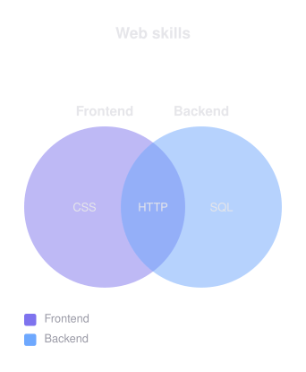

# Venn Diagrams

A Venn diagram is 2 or 3 overlapping sets with an optional title, optional region labels, and an optional legend.


- [Overview](#overview)
- [Format](#format)
- [Builder API](#builder-api)
- [Options](#options)
- [Themes](#themes)
- [Parse](#parse)
- [Debug](#debug)

## Overview

The model lives in `Atelier\Diagram\Venn\`: `VennDiagram` and `VennSet` (`id`, `label`, optional `cardinality`). All model classes are immutable.

Sets receive the ids `A`, `B`, `C` in declaration order. Regions are addressed by the ids of the sets they intersect: `A`, `B`, `C` for the exclusive regions, `AB`, `AC`, `BC` for the pairwise intersections, `ABC` for the center.

Reach for it to show membership overlap between a small number of categories: skills shared across roles, features across plans, tags across documents. Cardinalities are carried by the model but the schematic layout does not size regions by them.

## Format

This type has no Mermaid grammar; it is built through the PHP builder only. See [Parse](#parse).

## Builder API

`VennDiagramBuilder` (or `Diagram::venn()`, which returns it) is the one way to build the model:

```php
use Atelier\Diagram\Diagram;

$diagram = Diagram::venn()
    ->title('Web skills')
    ->set('Frontend', 42)        // becomes set A
    ->set('Backend', 35)         // becomes set B
    ->regionLabel('A', 'CSS')    // Frontend only
    ->regionLabel('B', 'SQL')    // Backend only
    ->regionLabel('AB', 'HTTP')  // intersection
    ->withLegend()
    ->build();

Diagram::of($diagram)->saveSvg('skills.svg');
```

- `set($label, $cardinality)` - adds a set (first call is A, second B, third C); the fourth call throws `InvalidDiagramException`. Cardinality is optional and ignored by the schematic layout.
- `regionLabel($region, $text)` - labels a region; last call wins per region. Unknown region keys throw immediately; references to undeclared sets (e.g. `BC` in a 2-set diagram) are checked on `build()`.
- `title($text)` - sets a title (not part of any text form).
- `withLegend()` - opts in to a set-to-color legend (off by default).
- `targetSize($width, $height)` - constrains the schematic into an exact canvas.
- `paddingPercent($percent)` - reserves outer canvas padding, resolved from the target size.
- `innerPaddingPercent($percent)` - reserves label padding inside each circle safe area.
- `circleStrokeWidth($px)` - draws a fixed-width contained circle stroke.
- `build()` - throws `InvalidDiagramException` for fewer than 2 sets or a region referencing an undeclared set.

## Options

| Setting | Default | Effect |
|---|---|---|
| `withLegend()` | no legend | set-to-colour legend at the bottom left |
| `title(string)` | none | heading above the schematic |
| `targetSize(float, float)` | unset | fixes the scene width and height instead of sizing to the geometry |
| `paddingPercent(float)` | `0` | canvas padding around the schematic |
| `innerPaddingPercent(float)` | `0` | label padding inside each circle safe area |
| `circleStrokeWidth(float)` | `0` | fixed circle stroke width |

- **Determinism**: layout is source-order based and deterministic; the same model always yields the same SVG.

`Layout\Venn\VennLayoutEngine` uses fixed schematic geometry: 2 sets as equal circles side by side, 3 sets on an equilateral triangle. Set labels sit outside the circles, region labels at approximate region centroids. The radius grows automatically when a region label is wider than the default circle.



Two sets instead of three. The layout engine places circles and region labels from the set count, so a Venn diagram is never hand-positioned.

## Themes

Venn diagrams fill the circles with `accentColors` at 0.5 opacity so intersections stay readable; the same palette drives the legend swatches. They also use `nodeStrokeColor` for circle strokes, `textColor` for set and region labels, and `fontFamily` / `fontSize` for text. A palette of at least 2 (3 for a triple diagram) distinct accent colors reads best; colors are cycled by set index.

All presets apply (`Theme::default()`, `dark()`, `blueprint()`, `mono()`, `neutral()`). See [Theming](../theming.md).

## Parse

Not applicable: this type has no Mermaid grammar, so `toMermaid()` / `toMarkdown()` throw and `Diagram::fromMermaid()` never returns one. SVG output works like for any other type.

## Debug

The builder throws `InvalidDiagramException` on invalid input (a fourth set, an unknown region key, a region referencing an undeclared set, or fewer than 2 sets). There is no parser, so no parser diagnostics apply.
