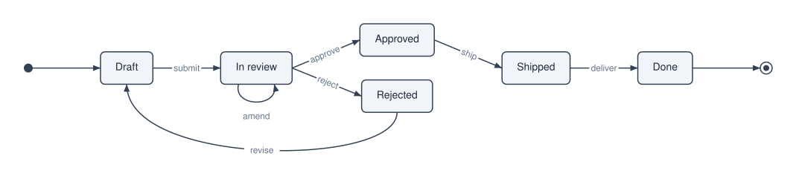
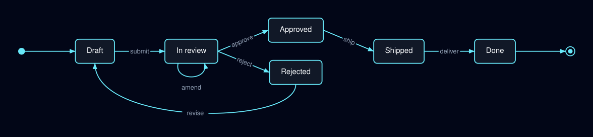
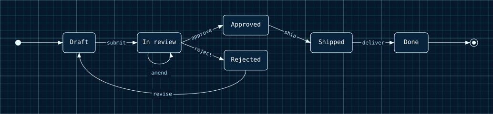
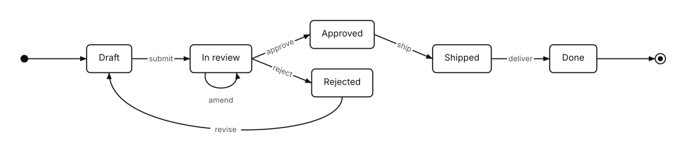
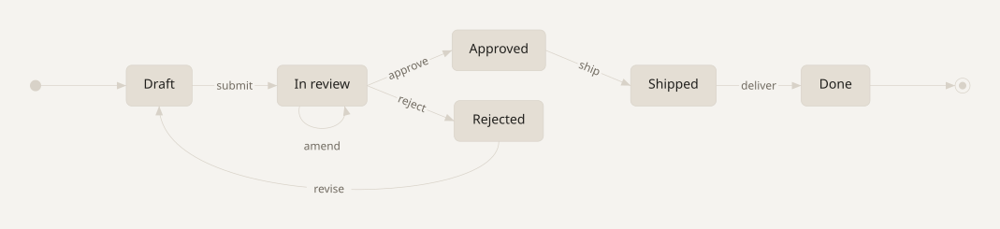

# Theming

`Atelier\Diagram\Theme\Theme` holds every visual decision: colors, font, spacing, stroke width. Layout engines read the theme while positioning; by the time a Scene exists, all styling is resolved into node styles. Renderers never see the theme.

Every facade exit takes an optional theme and falls back to `Theme::default()`:

```php
Diagram::of($model)->toSvg();        // default theme
Diagram::of($model)->toSvg($theme);  // custom theme
```

## Fields

`Theme` is `final readonly`; all fields are constructor-promoted and public.

| Field | Type | Role |
|---|---|---|
| `backgroundColor` | `string` | diagram background |
| `nodeFillColor` | `string` | default node fill (state boxes, badges) |
| `nodeStrokeColor` | `string` | default node outline and edge color |
| `textColor` | `string` | primary text |
| `mutedTextColor` | `string` | secondary text (edge labels, legends, commit ids) |
| `accentColors` | `list<string>` | non-empty; cycled for git branch lanes, Venn circles, and typed architecture/C4 nodes |
| `fontFamily` | `string` | font family for all text |
| `fontSize` | `float` | base font size, px (titles 1.15×, captions smaller) |
| `spacingUnit` | `float` | base spacing unit, px; all layout gaps are multiples of it |
| `strokeWidth` | `float` | base stroke width, px (default `1.5`); outlines and edges derive from it |
| `minNodeWidth` | `float|null` | optional minimum node width, px, used by layouts that support box nodes |
| `minNodeHeight` | `float|null` | optional minimum node height, px, used by layouts that support box nodes |
| `backgroundPattern` | `Scene\BackgroundPattern|null` | optional canvas decoration (grid or dots) painted behind the nodes |

Colors are plain strings: `#rrggbb` or CSS named colors. The constructor throws `InvalidArgumentException` for an empty `accentColors` list or non-positive `fontSize`, `spacingUnit`, `strokeWidth`, `minNodeWidth`, or `minNodeHeight`.

## Built-in themes

| Factory | Look |
|---|---|
| `Theme::default()` | light: white background, slate text, six accent colors, Helvetica at 14px, 8px spacing unit |
| `Theme::dark()` | deep navy background, light text, cyan outlines, six saturated accents |
| `Theme::blueprint()` | technical-drawing: navy field with a cyan minor grid and a heavier major grid, mono text, thin strokes |
| `Theme::mono()` | grayscale ink: white field, near-black outlines and text, no accent hues |
| `Theme::neutral()` | warm paper: soft beige field, low-contrast sand nodes, hairline strokes |

One state machine, five presets. Same model, same layout, same call: only the argument to `toSvg()` changed.

<div class="figure-grid">
<figure><figcaption><code>default()</code></figcaption></figure>
<figure><figcaption><code>dark()</code></figcaption></figure>
<figure><figcaption><code>blueprint()</code></figcaption></figure>
<figure><figcaption><code>mono()</code></figcaption></figure>
<figure><figcaption><code>neutral()</code></figcaption></figure>
</div>

These five carry their own colours, which is why they do not follow the page theme the way the other figures in this documentation do. That is the point of a preset: it decides the palette instead of inheriting one.

## A custom theme

There are no setters. Construct a new `Theme` with named arguments:

```php
use Atelier\Diagram\Diagram;
use Atelier\Diagram\Theme\Theme;

$dark = new Theme(
    backgroundColor: '#0f172a',
    nodeFillColor: '#1e293b',
    nodeStrokeColor: '#94a3b8',
    textColor: '#f1f5f9',
    mutedTextColor: '#94a3b8',
    accentColors: ['#60a5fa', '#f87171', '#4ade80', '#fbbf24'],
    fontFamily: 'Helvetica, Arial, sans-serif',
    fontSize: 14.0,
    spacingUnit: 8.0,
);

Diagram::of($model)->saveSvg('dark.svg', $dark);
```

Increasing `spacingUnit` spreads the whole layout proportionally; increasing `fontSize` grows nodes with their labels. Use `minNodeWidth` / `minNodeHeight` when a style needs consistent box geometry: supported layout engines account for these dimensions before computing gaps, edge endpoints, and arrowheads.

## Background pattern

A theme can carry a `Scene\BackgroundPattern` painted behind the nodes, on top of the solid `backgroundColor`. The facade transfers it onto the `Scene`, and the SVG renderer emits it as a concrete `<pattern>` (no CSS variables), so it rasterizes like any other output. The pattern remains renderer-agnostic data rather than SVG-specific configuration.

```php
use Atelier\Diagram\Scene\BackgroundPattern;
use Atelier\Diagram\Scene\PatternKind;
use Atelier\Diagram\Theme\Theme;

$grid = new BackgroundPattern(
    PatternKind::Grid,
    '#67e8f9',
    size: 16.0,           // minor cell, px
    lineWidth: 0.45,
    opacity: 0.26,
    majorColor: '#e6fbff', // optional heavier layer
    majorSize: 80.0,       // 0 disables the major layer
);

$theme = new Theme(/* ...palette... */, backgroundPattern: $grid);
```

`PatternKind::Dots` draws one dot per cell (`lineWidth` is the dot radius) instead of grid lines. `Theme::blueprint()` ships a minor/major grid out of the box.

Low-level `Scene\Style\ShapeStyle` also carries renderer-agnostic stroke details such as line caps and joins. `ShapeStyle::stroked()` defaults to rounded caps and joins so common routes and connector paths render softly without every layout engine repeating that policy.
